Time series anomaly detection - Canadian weather data
================
Ahmet Zamanis

- <a href="#introduction" id="toc-introduction">Introduction</a>
- <a href="#data-preparation" id="toc-data-preparation">Data
  preparation</a>
- <a href="#anomaly-detection" id="toc-anomaly-detection">Anomaly
  detection</a>
  - <a href="#k-means-clustering" id="toc-k-means-clustering">K-means
    clustering</a>
  - <a href="#gaussian-mixture-models-gmm"
    id="toc-gaussian-mixture-models-gmm">Gaussian mixture models (GMM)</a>
  - <a href="#ecod" id="toc-ecod">ECOD</a>
  - <a href="#principal-components-analysis-pca"
    id="toc-principal-components-analysis-pca">Principal components analysis
    (PCA)</a>
  - <a href="#isolation-forest" id="toc-isolation-forest">Isolation
    forest</a>
  - <a href="#autoencoder-with-pytorch-lightning"
    id="toc-autoencoder-with-pytorch-lightning">Autoencoder with PyTorch
    Lightning</a>
- <a href="#conclusion" id="toc-conclusion">Conclusion</a>

## Introduction

Introduce anomaly detection, packages, report structure

Introduce data & source

<details>
<summary>Show imports</summary>

``` python
# Data handling
import pandas as pd
import numpy as np
import arff # Installed as liac-arff
import warnings

# Plotting
import matplotlib.pyplot as plt
import seaborn as sns
import plotly.express as px
from IPython.display import IFrame

# Preprocessing
from sklearn.preprocessing import MinMaxScaler
from sklearn.preprocessing import StandardScaler
from darts.dataprocessing.transformers.scaler import Scaler
from darts.dataprocessing.transformers.missing_values_filler import MissingValuesFiller

# Darts
from darts.timeseries import TimeSeries
from darts.ad.scorers.kmeans_scorer import KMeansScorer
from darts.ad.scorers.pyod_scorer import PyODScorer
from darts.ad.detectors.quantile_detector import QuantileDetector

# PyOD anomaly scorers
from pyod.models.gmm import GMM
from pyod.models.ecod import ECOD
from pyod.models.pca import PCA
from pyod.models.iforest import IForest

# Torch and Lightning
import torch
import lightning as L
from X_LightningClassesAnom import TrainDataset, TestDataset, AutoEncoder

# Hyperparameter tuning
import optuna

# Dimensionality reduction
from sklearn.manifold import TSNE

# Helper functions
from X_HelperFunctionsAnom import score, detect, plot_series, plot_dist, plot_anom3d, plot_detection, validate_nn
```

</details>
<details>
<summary>Show settings</summary>

``` python
# Set print options
np.set_printoptions(suppress=True, precision=4)
pd.options.display.float_format = '{:.4f}'.format
pd.set_option('display.max_columns', None)

# Set plotting options
plt.rcParams['figure.dpi'] = 150
plt.rcParams["figure.autolayout"] = True
sns.set_style("darkgrid")
px_width = 800
px_height = 800

# Set Torch settings
torch.set_default_dtype(torch.float32)
torch.set_float32_matmul_precision('high')
L.seed_everything(1923, workers = True)
warnings.filterwarnings("ignore", ".*does not have many workers.*")
```

</details>

## Data preparation

``` python
# Load raw data from .arff
raw_data = arff.load(open("./InputData/canadian_climate.arff", "r"))

# Convert to Pandas dataframe & view
df = pd.DataFrame(
  raw_data["data"], columns = [x[0] for x in raw_data["attributes"]])
print(df)
```

                     LOCAL_DATE  MEAN_TEMPERATURE_CALGARY  \
    0      01-Jan-1940 00:00:00                  -11.4000   
    1      02-Jan-1940 00:00:00                  -12.0000   
    2      03-Jan-1940 00:00:00                  -12.0000   
    3      04-Jan-1940 00:00:00                  -11.4000   
    4      05-Jan-1940 00:00:00                  -13.1000   
    ...                     ...                       ...   
    29216  28-Dec-2019 00:00:00                   -7.7000   
    29217  29-Dec-2019 00:00:00                   -3.3000   
    29218  30-Dec-2019 00:00:00                   -1.6000   
    29219  31-Dec-2019 00:00:00                    4.3000   
    29220  01-Jan-2020 00:00:00                   -0.3000   

           TOTAL_PRECIPITATION_CALGARY  MEAN_TEMPERATURE_EDMONTON  \
    0                           0.5000                        NaN   
    1                           0.5000                        NaN   
    2                           1.0000                        NaN   
    3                           0.8000                        NaN   
    4                           0.5000                        NaN   
    ...                            ...                        ...   
    29216                       0.0000                   -10.4000   
    29217                       0.0000                    -8.6000   
    29218                       0.0000                   -10.3000   
    29219                       0.0000                    -2.6000   
    29220                       0.0000                    -4.0000   

           TOTAL_PRECIPITATION_EDMONTON  MEAN_TEMPERATURE_HALIFAX  \
    0                               NaN                       NaN   
    1                               NaN                       NaN   
    2                               NaN                       NaN   
    3                               NaN                       NaN   
    4                               NaN                       NaN   
    ...                             ...                       ...   
    29216                        0.0000                    2.1000   
    29217                        0.0000                   -2.7000   
    29218                        0.0000                   -3.5000   
    29219                        0.0000                    0.0000   
    29220                        0.0000                    1.8000   

           TOTAL_PRECIPITATION_HALIFAX  MEAN_TEMPERATURE_MONCTON  \
    0                              NaN                   -8.9000   
    1                              NaN                  -14.5000   
    2                              NaN                  -11.1000   
    3                              NaN                  -11.1000   
    4                              NaN                   -8.1000   
    ...                            ...                       ...   
    29216                       0.0000                    0.5000   
    29217                       0.0000                   -3.8000   
    29218                       0.0000                   -4.1000   
    29219                      11.4000                   -1.0000   
    29220                       0.4000                    0.2000   

           TOTAL_PRECIPITATION_MONCTON  MEAN_TEMPERATURE_MONTREAL  \
    0                           0.0000                        NaN   
    1                           0.0000                        NaN   
    2                           0.0000                        NaN   
    3                           0.3000                        NaN   
    4                           0.0000                        NaN   
    ...                            ...                        ...   
    29216                          NaN                     1.3000   
    29217                          NaN                    -0.9000   
    29218                          NaN                    -2.3000   
    29219                          NaN                    -0.2000   
    29220                          NaN                     0.2000   

           TOTAL_PRECIPITATION_MONTREAL  MEAN_TEMPERATURE_OTTAWA  \
    0                               NaN                 -17.0000   
    1                               NaN                 -16.7000   
    2                               NaN                 -12.3000   
    3                               NaN                 -16.4000   
    4                               NaN                 -19.5000   
    ...                             ...                      ...   
    29216                        0.0000                  -0.5000   
    29217                        0.0000                  -3.4000   
    29218                       13.4000                  -2.7000   
    29219                       11.4000                  -0.7000   
    29220                        0.9000                  -0.5000   

           TOTAL_PRECIPITATION_OTTAWA  MEAN_TEMPERATURE_QUEBEC  \
    0                          0.0000                      NaN   
    1                          0.5000                      NaN   
    2                          0.0000                      NaN   
    3                          0.0000                      NaN   
    4                          0.0000                      NaN   
    ...                           ...                      ...   
    29216                      0.0000                  -0.5000   
    29217                      0.8000                  -4.9000   
    29218                     12.7000                  -5.7000   
    29219                      6.6000                  -3.5000   
    29220                      0.0000                  -2.8000   

           TOTAL_PRECIPITATION_QUEBEC  MEAN_TEMPERATURE_SASKATOON  \
    0                             NaN                    -25.6000   
    1                             NaN                    -20.9000   
    2                             NaN                    -26.4000   
    3                             NaN                    -32.5000   
    4                             NaN                    -26.2000   
    ...                           ...                         ...   
    29216                      0.3000                    -15.3000   
    29217                      0.0000                    -15.6000   
    29218                      2.7000                    -15.0000   
    29219                      8.2000                     -8.2000   
    29220                      1.5000                     -7.9000   

           TOTAL_PRECIPITATION_SASKATOON  MEAN_TEMPERATURE_STJOHNS  \
    0                             0.0000                       NaN   
    1                             0.0000                       NaN   
    2                             0.0000                       NaN   
    3                             0.0000                       NaN   
    4                             0.0000                       NaN   
    ...                              ...                       ...   
    29216                            NaN                   -4.3000   
    29217                            NaN                   -0.9000   
    29218                            NaN                   -0.7000   
    29219                            NaN                   -1.2000   
    29220                            NaN                   -0.4000   

           TOTAL_PRECIPITATION_STJOHNS  MEAN_TEMPERATURE_TORONTO  \
    0                              NaN                   -8.9000   
    1                              NaN                  -13.1000   
    2                              NaN                   -6.1000   
    3                              NaN                   -6.4000   
    4                              NaN                   -7.2000   
    ...                            ...                       ...   
    29216                       5.3000                    3.0000   
    29217                       5.6000                    1.1000   
    29218                       0.7000                    5.6000   
    29219                       0.0000                    0.4000   
    29220                       6.4000                   -1.7000   

           TOTAL_PRECIPITATION_TORONTO  MEAN_TEMPERATURE_VANCOUVER  \
    0                           0.0000                      8.9000   
    1                           0.3000                      9.7000   
    2                           0.0000                      7.8000   
    3                           0.5000                      8.1000   
    4                          16.5000                      7.0000   
    ...                            ...                         ...   
    29216                       0.2000                      5.3000   
    29217                       7.8000                      7.1000   
    29218                       8.0000                      7.5000   
    29219                       2.0000                      8.4000   
    29220                       0.0000                      7.8000   

           TOTAL_PRECIPITATION_VANCOUVER  MEAN_TEMPERATURE_WHITEHORSE  \
    0                             5.8000                          NaN   
    1                             7.1000                          NaN   
    2                             1.0000                          NaN   
    3                             0.5000                          NaN   
    4                             0.8000                          NaN   
    ...                              ...                          ...   
    29216                         3.0000                      -9.0000   
    29217                         2.4000                      -2.8000   
    29218                         5.8000                      -0.1000   
    29219                        21.2000                      -1.1000   
    29220                         0.8000                      -4.2000   

           TOTAL_PRECIPITATION_WHITEHORSE  MEAN_TEMPERATURE_WINNIPEG  \
    0                                 NaN                   -20.9000   
    1                                 NaN                   -18.4000   
    2                                 NaN                   -22.0000   
    3                                 NaN                   -20.3000   
    4                                 NaN                   -18.7000   
    ...                               ...                        ...   
    29216                             NaN                    -4.7000   
    29217                             NaN                   -10.6000   
    29218                             NaN                   -10.9000   
    29219                             NaN                   -12.3000   
    29220                             NaN                    -7.0000   

           TOTAL_PRECIPITATION_WINNIPEG  
    0                            0.0000  
    1                            0.0000  
    2                            0.0000  
    3                            0.0000  
    4                            0.0000  
    ...                             ...  
    29216                        0.0000  
    29217                        1.7000  
    29218                        0.1000  
    29219                        0.0000  
    29220                        0.0000  

    [29221 rows x 27 columns]

``` python
# Convert LOCAL_DATE to datetime
df["LOCAL_DATE"] = pd.to_datetime(df["LOCAL_DATE"])

# Add cyclic terms for month, week of year and day of year
df["month_sin"] = np.sin(2 * np.pi * df["LOCAL_DATE"].dt.month / 12)
df["month_cos"] = np.cos(2 * np.pi * df["LOCAL_DATE"].dt.month / 12)
df["week_sin"] = np.sin(2 * np.pi * df["LOCAL_DATE"].dt.isocalendar().week / 53)
df["week_cos"] = np.cos(2 * np.pi * df["LOCAL_DATE"].dt.isocalendar().week / 53)
df["day_sin"] = np.sin(2 * np.pi * df["LOCAL_DATE"].dt.dayofyear / 366)
df["day_cos"] = np.cos(2 * np.pi * df["LOCAL_DATE"].dt.dayofyear / 366)
```

``` python
# Retrieve the weather data for Ottawa (1940 start) as Darts TimeSeries
ts_ottawa = TimeSeries.from_dataframe(
  df,
  time_col = "LOCAL_DATE",
  value_cols = ["MEAN_TEMPERATURE_OTTAWA", "TOTAL_PRECIPITATION_OTTAWA"],
  fill_missing_dates = True
)
ts_ottawa

# Interpolate missing values
na_filler = MissingValuesFiller()
ts_ottawa = na_filler.transform(ts_ottawa)
```

``` python
# Retrieve date covariates as Darts TS
ts_covars = TimeSeries.from_dataframe(
  df,
  time_col = "LOCAL_DATE",
  value_cols = ['month_sin', 'month_cos', 'week_sin', 'week_cos', 'day_sin', 
  'day_cos'],
  fill_missing_dates = True
)
ts_covars
```

<div><svg style="position: absolute; width: 0; height: 0; overflow: hidden">
<defs>
<symbol id="icon-database" viewBox="0 0 32 32">
<path d="M16 0c-8.837 0-16 2.239-16 5v4c0 2.761 7.163 5 16 5s16-2.239 16-5v-4c0-2.761-7.163-5-16-5z"></path>
<path d="M16 17c-8.837 0-16-2.239-16-5v6c0 2.761 7.163 5 16 5s16-2.239 16-5v-6c0 2.761-7.163 5-16 5z"></path>
<path d="M16 26c-8.837 0-16-2.239-16-5v6c0 2.761 7.163 5 16 5s16-2.239 16-5v-6c0 2.761-7.163 5-16 5z"></path>
</symbol>
<symbol id="icon-file-text2" viewBox="0 0 32 32">
<path d="M28.681 7.159c-0.694-0.947-1.662-2.053-2.724-3.116s-2.169-2.030-3.116-2.724c-1.612-1.182-2.393-1.319-2.841-1.319h-15.5c-1.378 0-2.5 1.121-2.5 2.5v27c0 1.378 1.122 2.5 2.5 2.5h23c1.378 0 2.5-1.122 2.5-2.5v-19.5c0-0.448-0.137-1.23-1.319-2.841zM24.543 5.457c0.959 0.959 1.712 1.825 2.268 2.543h-4.811v-4.811c0.718 0.556 1.584 1.309 2.543 2.268zM28 29.5c0 0.271-0.229 0.5-0.5 0.5h-23c-0.271 0-0.5-0.229-0.5-0.5v-27c0-0.271 0.229-0.5 0.5-0.5 0 0 15.499-0 15.5 0v7c0 0.552 0.448 1 1 1h7v19.5z"></path>
<path d="M23 26h-14c-0.552 0-1-0.448-1-1s0.448-1 1-1h14c0.552 0 1 0.448 1 1s-0.448 1-1 1z"></path>
<path d="M23 22h-14c-0.552 0-1-0.448-1-1s0.448-1 1-1h14c0.552 0 1 0.448 1 1s-0.448 1-1 1z"></path>
<path d="M23 18h-14c-0.552 0-1-0.448-1-1s0.448-1 1-1h14c0.552 0 1 0.448 1 1s-0.448 1-1 1z"></path>
</symbol>
</defs>
</svg>
<style>/* CSS stylesheet for displaying xarray objects in jupyterlab.
 *
 */

:root {
  --xr-font-color0: var(--jp-content-font-color0, rgba(0, 0, 0, 1));
  --xr-font-color2: var(--jp-content-font-color2, rgba(0, 0, 0, 0.54));
  --xr-font-color3: var(--jp-content-font-color3, rgba(0, 0, 0, 0.38));
  --xr-border-color: var(--jp-border-color2, #e0e0e0);
  --xr-disabled-color: var(--jp-layout-color3, #bdbdbd);
  --xr-background-color: var(--jp-layout-color0, white);
  --xr-background-color-row-even: var(--jp-layout-color1, white);
  --xr-background-color-row-odd: var(--jp-layout-color2, #eeeeee);
}

html[theme=dark],
body[data-theme=dark],
body.vscode-dark {
  --xr-font-color0: rgba(255, 255, 255, 1);
  --xr-font-color2: rgba(255, 255, 255, 0.54);
  --xr-font-color3: rgba(255, 255, 255, 0.38);
  --xr-border-color: #1F1F1F;
  --xr-disabled-color: #515151;
  --xr-background-color: #111111;
  --xr-background-color-row-even: #111111;
  --xr-background-color-row-odd: #313131;
}

.xr-wrap {
  display: block !important;
  min-width: 300px;
  max-width: 700px;
}

.xr-text-repr-fallback {
  /* fallback to plain text repr when CSS is not injected (untrusted notebook) */
  display: none;
}

.xr-header {
  padding-top: 6px;
  padding-bottom: 6px;
  margin-bottom: 4px;
  border-bottom: solid 1px var(--xr-border-color);
}

.xr-header > div,
.xr-header > ul {
  display: inline;
  margin-top: 0;
  margin-bottom: 0;
}

.xr-obj-type,
.xr-array-name {
  margin-left: 2px;
  margin-right: 10px;
}

.xr-obj-type {
  color: var(--xr-font-color2);
}

.xr-sections {
  padding-left: 0 !important;
  display: grid;
  grid-template-columns: 150px auto auto 1fr 20px 20px;
}

.xr-section-item {
  display: contents;
}

.xr-section-item input {
  display: none;
}

.xr-section-item input + label {
  color: var(--xr-disabled-color);
}

.xr-section-item input:enabled + label {
  cursor: pointer;
  color: var(--xr-font-color2);
}

.xr-section-item input:enabled + label:hover {
  color: var(--xr-font-color0);
}

.xr-section-summary {
  grid-column: 1;
  color: var(--xr-font-color2);
  font-weight: 500;
}

.xr-section-summary > span {
  display: inline-block;
  padding-left: 0.5em;
}

.xr-section-summary-in:disabled + label {
  color: var(--xr-font-color2);
}

.xr-section-summary-in + label:before {
  display: inline-block;
  content: '►';
  font-size: 11px;
  width: 15px;
  text-align: center;
}

.xr-section-summary-in:disabled + label:before {
  color: var(--xr-disabled-color);
}

.xr-section-summary-in:checked + label:before {
  content: '▼';
}

.xr-section-summary-in:checked + label > span {
  display: none;
}

.xr-section-summary,
.xr-section-inline-details {
  padding-top: 4px;
  padding-bottom: 4px;
}

.xr-section-inline-details {
  grid-column: 2 / -1;
}

.xr-section-details {
  display: none;
  grid-column: 1 / -1;
  margin-bottom: 5px;
}

.xr-section-summary-in:checked ~ .xr-section-details {
  display: contents;
}

.xr-array-wrap {
  grid-column: 1 / -1;
  display: grid;
  grid-template-columns: 20px auto;
}

.xr-array-wrap > label {
  grid-column: 1;
  vertical-align: top;
}

.xr-preview {
  color: var(--xr-font-color3);
}

.xr-array-preview,
.xr-array-data {
  padding: 0 5px !important;
  grid-column: 2;
}

.xr-array-data,
.xr-array-in:checked ~ .xr-array-preview {
  display: none;
}

.xr-array-in:checked ~ .xr-array-data,
.xr-array-preview {
  display: inline-block;
}

.xr-dim-list {
  display: inline-block !important;
  list-style: none;
  padding: 0 !important;
  margin: 0;
}

.xr-dim-list li {
  display: inline-block;
  padding: 0;
  margin: 0;
}

.xr-dim-list:before {
  content: '(';
}

.xr-dim-list:after {
  content: ')';
}

.xr-dim-list li:not(:last-child):after {
  content: ',';
  padding-right: 5px;
}

.xr-has-index {
  font-weight: bold;
}

.xr-var-list,
.xr-var-item {
  display: contents;
}

.xr-var-item > div,
.xr-var-item label,
.xr-var-item > .xr-var-name span {
  background-color: var(--xr-background-color-row-even);
  margin-bottom: 0;
}

.xr-var-item > .xr-var-name:hover span {
  padding-right: 5px;
}

.xr-var-list > li:nth-child(odd) > div,
.xr-var-list > li:nth-child(odd) > label,
.xr-var-list > li:nth-child(odd) > .xr-var-name span {
  background-color: var(--xr-background-color-row-odd);
}

.xr-var-name {
  grid-column: 1;
}

.xr-var-dims {
  grid-column: 2;
}

.xr-var-dtype {
  grid-column: 3;
  text-align: right;
  color: var(--xr-font-color2);
}

.xr-var-preview {
  grid-column: 4;
}

.xr-index-preview {
  grid-column: 2 / 5;
  color: var(--xr-font-color2);
}

.xr-var-name,
.xr-var-dims,
.xr-var-dtype,
.xr-preview,
.xr-attrs dt {
  white-space: nowrap;
  overflow: hidden;
  text-overflow: ellipsis;
  padding-right: 10px;
}

.xr-var-name:hover,
.xr-var-dims:hover,
.xr-var-dtype:hover,
.xr-attrs dt:hover {
  overflow: visible;
  width: auto;
  z-index: 1;
}

.xr-var-attrs,
.xr-var-data,
.xr-index-data {
  display: none;
  background-color: var(--xr-background-color) !important;
  padding-bottom: 5px !important;
}

.xr-var-attrs-in:checked ~ .xr-var-attrs,
.xr-var-data-in:checked ~ .xr-var-data,
.xr-index-data-in:checked ~ .xr-index-data {
  display: block;
}

.xr-var-data > table {
  float: right;
}

.xr-var-name span,
.xr-var-data,
.xr-index-name div,
.xr-index-data,
.xr-attrs {
  padding-left: 25px !important;
}

.xr-attrs,
.xr-var-attrs,
.xr-var-data,
.xr-index-data {
  grid-column: 1 / -1;
}

dl.xr-attrs {
  padding: 0;
  margin: 0;
  display: grid;
  grid-template-columns: 125px auto;
}

.xr-attrs dt,
.xr-attrs dd {
  padding: 0;
  margin: 0;
  float: left;
  padding-right: 10px;
  width: auto;
}

.xr-attrs dt {
  font-weight: normal;
  grid-column: 1;
}

.xr-attrs dt:hover span {
  display: inline-block;
  background: var(--xr-background-color);
  padding-right: 10px;
}

.xr-attrs dd {
  grid-column: 2;
  white-space: pre-wrap;
  word-break: break-all;
}

.xr-icon-database,
.xr-icon-file-text2,
.xr-no-icon {
  display: inline-block;
  vertical-align: middle;
  width: 1em;
  height: 1.5em !important;
  stroke-width: 0;
  stroke: currentColor;
  fill: currentColor;
}
</style><pre class='xr-text-repr-fallback'>&lt;TimeSeries (DataArray) (LOCAL_DATE: 29221, component: 6, sample: 1)&gt;
array([[[ 0.5   ],
        [ 0.866 ],
        [ 0.1183],
        [ 0.993 ],
        [ 0.0172],
        [ 0.9999]],

       [[ 0.5   ],
        [ 0.866 ],
        [ 0.1183],
        [ 0.993 ],
        [ 0.0343],
        [ 0.9994]],

       [[ 0.5   ],
        [ 0.866 ],
        [ 0.1183],
        [ 0.993 ],
        [ 0.0515],
        [ 0.9987]],
...
       [[-0.    ],
        [ 1.    ],
        [ 0.1183],
        [ 0.993 ],
        [-0.0343],
        [ 0.9994]],

       [[-0.    ],
        [ 1.    ],
        [ 0.1183],
        [ 0.993 ],
        [-0.0172],
        [ 0.9999]],

       [[ 0.5   ],
        [ 0.866 ],
        [ 0.1183],
        [ 0.993 ],
        [ 0.0172],
        [ 0.9999]]])
Coordinates:
  * LOCAL_DATE  (LOCAL_DATE) datetime64[ns] 1940-01-01 1940-01-02 ... 2020-01-01
  * component   (component) object &#x27;month_sin&#x27; &#x27;month_cos&#x27; ... &#x27;day_cos&#x27;
Dimensions without coordinates: sample
Attributes:
    static_covariates:  None
    hierarchy:          None</pre><div class='xr-wrap' style='display:none'><div class='xr-header'><div class='xr-obj-type'>TimeSeries (DataArray)</div><div class='xr-array-name'></div><ul class='xr-dim-list'><li><span class='xr-has-index'>LOCAL_DATE</span>: 29221</li><li><span class='xr-has-index'>component</span>: 6</li><li><span>sample</span>: 1</li></ul></div><ul class='xr-sections'><li class='xr-section-item'><div class='xr-array-wrap'><input id='section-91c104f7-c0ce-4be8-8634-411fe6dbadc6' class='xr-array-in' type='checkbox' checked><label for='section-91c104f7-c0ce-4be8-8634-411fe6dbadc6' title='Show/hide data repr'><svg class='icon xr-icon-database'><use xlink:href='#icon-database'></use></svg></label><div class='xr-array-preview xr-preview'><span>0.5 0.866 0.1183 0.993 0.01717 ... 0.866 0.1183 0.993 0.01717 0.9999</span></div><div class='xr-array-data'><pre>array([[[ 0.5   ],
        [ 0.866 ],
        [ 0.1183],
        [ 0.993 ],
        [ 0.0172],
        [ 0.9999]],

       [[ 0.5   ],
        [ 0.866 ],
        [ 0.1183],
        [ 0.993 ],
        [ 0.0343],
        [ 0.9994]],

       [[ 0.5   ],
        [ 0.866 ],
        [ 0.1183],
        [ 0.993 ],
        [ 0.0515],
        [ 0.9987]],
...
       [[-0.    ],
        [ 1.    ],
        [ 0.1183],
        [ 0.993 ],
        [-0.0343],
        [ 0.9994]],

       [[-0.    ],
        [ 1.    ],
        [ 0.1183],
        [ 0.993 ],
        [-0.0172],
        [ 0.9999]],

       [[ 0.5   ],
        [ 0.866 ],
        [ 0.1183],
        [ 0.993 ],
        [ 0.0172],
        [ 0.9999]]])</pre></div></div></li><li class='xr-section-item'><input id='section-1eb923d7-ee2b-43ad-b98b-eae8f04d4eab' class='xr-section-summary-in' type='checkbox'  checked><label for='section-1eb923d7-ee2b-43ad-b98b-eae8f04d4eab' class='xr-section-summary' >Coordinates: <span>(2)</span></label><div class='xr-section-inline-details'></div><div class='xr-section-details'><ul class='xr-var-list'><li class='xr-var-item'><div class='xr-var-name'><span class='xr-has-index'>LOCAL_DATE</span></div><div class='xr-var-dims'>(LOCAL_DATE)</div><div class='xr-var-dtype'>datetime64[ns]</div><div class='xr-var-preview xr-preview'>1940-01-01 ... 2020-01-01</div><input id='attrs-65bb2334-406b-4fb8-87e5-73d77ef38355' class='xr-var-attrs-in' type='checkbox' disabled><label for='attrs-65bb2334-406b-4fb8-87e5-73d77ef38355' title='Show/Hide attributes'><svg class='icon xr-icon-file-text2'><use xlink:href='#icon-file-text2'></use></svg></label><input id='data-6fc9b04b-c7f7-4211-9009-5e05697734ec' class='xr-var-data-in' type='checkbox'><label for='data-6fc9b04b-c7f7-4211-9009-5e05697734ec' title='Show/Hide data repr'><svg class='icon xr-icon-database'><use xlink:href='#icon-database'></use></svg></label><div class='xr-var-attrs'><dl class='xr-attrs'></dl></div><div class='xr-var-data'><pre>array([&#x27;1940-01-01T00:00:00.000000000&#x27;, &#x27;1940-01-02T00:00:00.000000000&#x27;,
       &#x27;1940-01-03T00:00:00.000000000&#x27;, ..., &#x27;2019-12-30T00:00:00.000000000&#x27;,
       &#x27;2019-12-31T00:00:00.000000000&#x27;, &#x27;2020-01-01T00:00:00.000000000&#x27;],
      dtype=&#x27;datetime64[ns]&#x27;)</pre></div></li><li class='xr-var-item'><div class='xr-var-name'><span class='xr-has-index'>component</span></div><div class='xr-var-dims'>(component)</div><div class='xr-var-dtype'>object</div><div class='xr-var-preview xr-preview'>&#x27;month_sin&#x27; ... &#x27;day_cos&#x27;</div><input id='attrs-95969b97-690c-4508-a1f9-7b757f8d76d3' class='xr-var-attrs-in' type='checkbox' disabled><label for='attrs-95969b97-690c-4508-a1f9-7b757f8d76d3' title='Show/Hide attributes'><svg class='icon xr-icon-file-text2'><use xlink:href='#icon-file-text2'></use></svg></label><input id='data-22a2fe58-d64f-41dc-b40d-73c7487c0ab9' class='xr-var-data-in' type='checkbox'><label for='data-22a2fe58-d64f-41dc-b40d-73c7487c0ab9' title='Show/Hide data repr'><svg class='icon xr-icon-database'><use xlink:href='#icon-database'></use></svg></label><div class='xr-var-attrs'><dl class='xr-attrs'></dl></div><div class='xr-var-data'><pre>array([&#x27;month_sin&#x27;, &#x27;month_cos&#x27;, &#x27;week_sin&#x27;, &#x27;week_cos&#x27;, &#x27;day_sin&#x27;, &#x27;day_cos&#x27;],
      dtype=object)</pre></div></li></ul></div></li><li class='xr-section-item'><input id='section-f45a4dd4-728a-4940-b5b7-ba9ef56323ef' class='xr-section-summary-in' type='checkbox'  ><label for='section-f45a4dd4-728a-4940-b5b7-ba9ef56323ef' class='xr-section-summary' >Indexes: <span>(2)</span></label><div class='xr-section-inline-details'></div><div class='xr-section-details'><ul class='xr-var-list'><li class='xr-var-item'><div class='xr-index-name'><div>LOCAL_DATE</div></div><div class='xr-index-preview'>PandasIndex</div><div></div><input id='index-6bbc511a-47e4-4622-85cf-02ce11f37cac' class='xr-index-data-in' type='checkbox'/><label for='index-6bbc511a-47e4-4622-85cf-02ce11f37cac' title='Show/Hide index repr'><svg class='icon xr-icon-database'><use xlink:href='#icon-database'></use></svg></label><div class='xr-index-data'><pre>PandasIndex(DatetimeIndex([&#x27;1940-01-01&#x27;, &#x27;1940-01-02&#x27;, &#x27;1940-01-03&#x27;, &#x27;1940-01-04&#x27;,
               &#x27;1940-01-05&#x27;, &#x27;1940-01-06&#x27;, &#x27;1940-01-07&#x27;, &#x27;1940-01-08&#x27;,
               &#x27;1940-01-09&#x27;, &#x27;1940-01-10&#x27;,
               ...
               &#x27;2019-12-23&#x27;, &#x27;2019-12-24&#x27;, &#x27;2019-12-25&#x27;, &#x27;2019-12-26&#x27;,
               &#x27;2019-12-27&#x27;, &#x27;2019-12-28&#x27;, &#x27;2019-12-29&#x27;, &#x27;2019-12-30&#x27;,
               &#x27;2019-12-31&#x27;, &#x27;2020-01-01&#x27;],
              dtype=&#x27;datetime64[ns]&#x27;, name=&#x27;LOCAL_DATE&#x27;, length=29221, freq=&#x27;D&#x27;))</pre></div></li><li class='xr-var-item'><div class='xr-index-name'><div>component</div></div><div class='xr-index-preview'>PandasIndex</div><div></div><input id='index-caaae220-73f4-45a9-a4c0-e084c4ce7148' class='xr-index-data-in' type='checkbox'/><label for='index-caaae220-73f4-45a9-a4c0-e084c4ce7148' title='Show/Hide index repr'><svg class='icon xr-icon-database'><use xlink:href='#icon-database'></use></svg></label><div class='xr-index-data'><pre>PandasIndex(Index([&#x27;month_sin&#x27;, &#x27;month_cos&#x27;, &#x27;week_sin&#x27;, &#x27;week_cos&#x27;, &#x27;day_sin&#x27;, &#x27;day_cos&#x27;], dtype=&#x27;object&#x27;, name=&#x27;component&#x27;))</pre></div></li></ul></div></li><li class='xr-section-item'><input id='section-8b6ed65c-f836-4190-b66d-aabbcec0bbd5' class='xr-section-summary-in' type='checkbox'  checked><label for='section-8b6ed65c-f836-4190-b66d-aabbcec0bbd5' class='xr-section-summary' >Attributes: <span>(2)</span></label><div class='xr-section-inline-details'></div><div class='xr-section-details'><dl class='xr-attrs'><dt><span>static_covariates :</span></dt><dd>None</dd><dt><span>hierarchy :</span></dt><dd>None</dd></dl></div></li></ul></div></div>

``` python
# Concatenate time covariates to Ottawa weather series
ts_ottawa = ts_ottawa.concatenate(ts_covars, axis = 1)

# Split train-test data
test_start = pd.Timestamp("1980-01-01")
train_end = pd.Timestamp("1979-12-31")
ts_train = ts_ottawa.drop_after(test_start)
ts_test = ts_ottawa.drop_before(train_end)
```

## Anomaly detection

``` python
# Create Darts wrapper for MinMaxScaler
feature_range = (-1, 1) # The value range of cyclical encoded features
scaler = Scaler(MinMaxScaler(feature_range = feature_range))

# Create quantile detector
q = 0.99 # The detectpr will flag scores above this quantile as anomalies
detector = QuantileDetector(high_quantile = q)
```

### K-means clustering

``` python
# Create K-means scorer
scorer_kmeans = KMeansScorer(
  window = 1, # Score each time step by itself
  k = 12, # Number of K-means clusters
  random_state = 1923)

# Perform anomaly scoring
scores_train_kmeans, scores_test_kmeans, scores_kmeans = score(
  ts_train, ts_test, scorer_kmeans, scaler)
scores_kmeans
```

<div><svg style="position: absolute; width: 0; height: 0; overflow: hidden">
<defs>
<symbol id="icon-database" viewBox="0 0 32 32">
<path d="M16 0c-8.837 0-16 2.239-16 5v4c0 2.761 7.163 5 16 5s16-2.239 16-5v-4c0-2.761-7.163-5-16-5z"></path>
<path d="M16 17c-8.837 0-16-2.239-16-5v6c0 2.761 7.163 5 16 5s16-2.239 16-5v-6c0 2.761-7.163 5-16 5z"></path>
<path d="M16 26c-8.837 0-16-2.239-16-5v6c0 2.761 7.163 5 16 5s16-2.239 16-5v-6c0 2.761-7.163 5-16 5z"></path>
</symbol>
<symbol id="icon-file-text2" viewBox="0 0 32 32">
<path d="M28.681 7.159c-0.694-0.947-1.662-2.053-2.724-3.116s-2.169-2.030-3.116-2.724c-1.612-1.182-2.393-1.319-2.841-1.319h-15.5c-1.378 0-2.5 1.121-2.5 2.5v27c0 1.378 1.122 2.5 2.5 2.5h23c1.378 0 2.5-1.122 2.5-2.5v-19.5c0-0.448-0.137-1.23-1.319-2.841zM24.543 5.457c0.959 0.959 1.712 1.825 2.268 2.543h-4.811v-4.811c0.718 0.556 1.584 1.309 2.543 2.268zM28 29.5c0 0.271-0.229 0.5-0.5 0.5h-23c-0.271 0-0.5-0.229-0.5-0.5v-27c0-0.271 0.229-0.5 0.5-0.5 0 0 15.499-0 15.5 0v7c0 0.552 0.448 1 1 1h7v19.5z"></path>
<path d="M23 26h-14c-0.552 0-1-0.448-1-1s0.448-1 1-1h14c0.552 0 1 0.448 1 1s-0.448 1-1 1z"></path>
<path d="M23 22h-14c-0.552 0-1-0.448-1-1s0.448-1 1-1h14c0.552 0 1 0.448 1 1s-0.448 1-1 1z"></path>
<path d="M23 18h-14c-0.552 0-1-0.448-1-1s0.448-1 1-1h14c0.552 0 1 0.448 1 1s-0.448 1-1 1z"></path>
</symbol>
</defs>
</svg>
<style>/* CSS stylesheet for displaying xarray objects in jupyterlab.
 *
 */

:root {
  --xr-font-color0: var(--jp-content-font-color0, rgba(0, 0, 0, 1));
  --xr-font-color2: var(--jp-content-font-color2, rgba(0, 0, 0, 0.54));
  --xr-font-color3: var(--jp-content-font-color3, rgba(0, 0, 0, 0.38));
  --xr-border-color: var(--jp-border-color2, #e0e0e0);
  --xr-disabled-color: var(--jp-layout-color3, #bdbdbd);
  --xr-background-color: var(--jp-layout-color0, white);
  --xr-background-color-row-even: var(--jp-layout-color1, white);
  --xr-background-color-row-odd: var(--jp-layout-color2, #eeeeee);
}

html[theme=dark],
body[data-theme=dark],
body.vscode-dark {
  --xr-font-color0: rgba(255, 255, 255, 1);
  --xr-font-color2: rgba(255, 255, 255, 0.54);
  --xr-font-color3: rgba(255, 255, 255, 0.38);
  --xr-border-color: #1F1F1F;
  --xr-disabled-color: #515151;
  --xr-background-color: #111111;
  --xr-background-color-row-even: #111111;
  --xr-background-color-row-odd: #313131;
}

.xr-wrap {
  display: block !important;
  min-width: 300px;
  max-width: 700px;
}

.xr-text-repr-fallback {
  /* fallback to plain text repr when CSS is not injected (untrusted notebook) */
  display: none;
}

.xr-header {
  padding-top: 6px;
  padding-bottom: 6px;
  margin-bottom: 4px;
  border-bottom: solid 1px var(--xr-border-color);
}

.xr-header > div,
.xr-header > ul {
  display: inline;
  margin-top: 0;
  margin-bottom: 0;
}

.xr-obj-type,
.xr-array-name {
  margin-left: 2px;
  margin-right: 10px;
}

.xr-obj-type {
  color: var(--xr-font-color2);
}

.xr-sections {
  padding-left: 0 !important;
  display: grid;
  grid-template-columns: 150px auto auto 1fr 20px 20px;
}

.xr-section-item {
  display: contents;
}

.xr-section-item input {
  display: none;
}

.xr-section-item input + label {
  color: var(--xr-disabled-color);
}

.xr-section-item input:enabled + label {
  cursor: pointer;
  color: var(--xr-font-color2);
}

.xr-section-item input:enabled + label:hover {
  color: var(--xr-font-color0);
}

.xr-section-summary {
  grid-column: 1;
  color: var(--xr-font-color2);
  font-weight: 500;
}

.xr-section-summary > span {
  display: inline-block;
  padding-left: 0.5em;
}

.xr-section-summary-in:disabled + label {
  color: var(--xr-font-color2);
}

.xr-section-summary-in + label:before {
  display: inline-block;
  content: '►';
  font-size: 11px;
  width: 15px;
  text-align: center;
}

.xr-section-summary-in:disabled + label:before {
  color: var(--xr-disabled-color);
}

.xr-section-summary-in:checked + label:before {
  content: '▼';
}

.xr-section-summary-in:checked + label > span {
  display: none;
}

.xr-section-summary,
.xr-section-inline-details {
  padding-top: 4px;
  padding-bottom: 4px;
}

.xr-section-inline-details {
  grid-column: 2 / -1;
}

.xr-section-details {
  display: none;
  grid-column: 1 / -1;
  margin-bottom: 5px;
}

.xr-section-summary-in:checked ~ .xr-section-details {
  display: contents;
}

.xr-array-wrap {
  grid-column: 1 / -1;
  display: grid;
  grid-template-columns: 20px auto;
}

.xr-array-wrap > label {
  grid-column: 1;
  vertical-align: top;
}

.xr-preview {
  color: var(--xr-font-color3);
}

.xr-array-preview,
.xr-array-data {
  padding: 0 5px !important;
  grid-column: 2;
}

.xr-array-data,
.xr-array-in:checked ~ .xr-array-preview {
  display: none;
}

.xr-array-in:checked ~ .xr-array-data,
.xr-array-preview {
  display: inline-block;
}

.xr-dim-list {
  display: inline-block !important;
  list-style: none;
  padding: 0 !important;
  margin: 0;
}

.xr-dim-list li {
  display: inline-block;
  padding: 0;
  margin: 0;
}

.xr-dim-list:before {
  content: '(';
}

.xr-dim-list:after {
  content: ')';
}

.xr-dim-list li:not(:last-child):after {
  content: ',';
  padding-right: 5px;
}

.xr-has-index {
  font-weight: bold;
}

.xr-var-list,
.xr-var-item {
  display: contents;
}

.xr-var-item > div,
.xr-var-item label,
.xr-var-item > .xr-var-name span {
  background-color: var(--xr-background-color-row-even);
  margin-bottom: 0;
}

.xr-var-item > .xr-var-name:hover span {
  padding-right: 5px;
}

.xr-var-list > li:nth-child(odd) > div,
.xr-var-list > li:nth-child(odd) > label,
.xr-var-list > li:nth-child(odd) > .xr-var-name span {
  background-color: var(--xr-background-color-row-odd);
}

.xr-var-name {
  grid-column: 1;
}

.xr-var-dims {
  grid-column: 2;
}

.xr-var-dtype {
  grid-column: 3;
  text-align: right;
  color: var(--xr-font-color2);
}

.xr-var-preview {
  grid-column: 4;
}

.xr-index-preview {
  grid-column: 2 / 5;
  color: var(--xr-font-color2);
}

.xr-var-name,
.xr-var-dims,
.xr-var-dtype,
.xr-preview,
.xr-attrs dt {
  white-space: nowrap;
  overflow: hidden;
  text-overflow: ellipsis;
  padding-right: 10px;
}

.xr-var-name:hover,
.xr-var-dims:hover,
.xr-var-dtype:hover,
.xr-attrs dt:hover {
  overflow: visible;
  width: auto;
  z-index: 1;
}

.xr-var-attrs,
.xr-var-data,
.xr-index-data {
  display: none;
  background-color: var(--xr-background-color) !important;
  padding-bottom: 5px !important;
}

.xr-var-attrs-in:checked ~ .xr-var-attrs,
.xr-var-data-in:checked ~ .xr-var-data,
.xr-index-data-in:checked ~ .xr-index-data {
  display: block;
}

.xr-var-data > table {
  float: right;
}

.xr-var-name span,
.xr-var-data,
.xr-index-name div,
.xr-index-data,
.xr-attrs {
  padding-left: 25px !important;
}

.xr-attrs,
.xr-var-attrs,
.xr-var-data,
.xr-index-data {
  grid-column: 1 / -1;
}

dl.xr-attrs {
  padding: 0;
  margin: 0;
  display: grid;
  grid-template-columns: 125px auto;
}

.xr-attrs dt,
.xr-attrs dd {
  padding: 0;
  margin: 0;
  float: left;
  padding-right: 10px;
  width: auto;
}

.xr-attrs dt {
  font-weight: normal;
  grid-column: 1;
}

.xr-attrs dt:hover span {
  display: inline-block;
  background: var(--xr-background-color);
  padding-right: 10px;
}

.xr-attrs dd {
  grid-column: 2;
  white-space: pre-wrap;
  word-break: break-all;
}

.xr-icon-database,
.xr-icon-file-text2,
.xr-no-icon {
  display: inline-block;
  vertical-align: middle;
  width: 1em;
  height: 1.5em !important;
  stroke-width: 0;
  stroke: currentColor;
  fill: currentColor;
}
</style><pre class='xr-text-repr-fallback'>&lt;TimeSeries (DataArray) (LOCAL_DATE: 29221, component: 1, sample: 1)&gt;
array([[[0.3829]],

       [[0.3652]],

       [[0.3068]],

       ...,

       [[0.5591]],

       [[0.5418]],

       [[0.4808]]])
Coordinates:
  * LOCAL_DATE  (LOCAL_DATE) datetime64[ns] 1940-01-01 1940-01-02 ... 2020-01-01
  * component   (component) object &#x27;0&#x27;
Dimensions without coordinates: sample
Attributes:
    static_covariates:  None
    hierarchy:          None</pre><div class='xr-wrap' style='display:none'><div class='xr-header'><div class='xr-obj-type'>TimeSeries (DataArray)</div><div class='xr-array-name'></div><ul class='xr-dim-list'><li><span class='xr-has-index'>LOCAL_DATE</span>: 29221</li><li><span class='xr-has-index'>component</span>: 1</li><li><span>sample</span>: 1</li></ul></div><ul class='xr-sections'><li class='xr-section-item'><div class='xr-array-wrap'><input id='section-2ea017ef-af2f-4cd8-9261-bcb219f8148f' class='xr-array-in' type='checkbox' checked><label for='section-2ea017ef-af2f-4cd8-9261-bcb219f8148f' title='Show/hide data repr'><svg class='icon xr-icon-database'><use xlink:href='#icon-database'></use></svg></label><div class='xr-array-preview xr-preview'><span>0.3829 0.3652 0.3068 0.3404 0.3943 ... 0.3173 0.5591 0.5418 0.4808</span></div><div class='xr-array-data'><pre>array([[[0.3829]],

       [[0.3652]],

       [[0.3068]],

       ...,

       [[0.5591]],

       [[0.5418]],

       [[0.4808]]])</pre></div></div></li><li class='xr-section-item'><input id='section-9e6ca5f3-d25c-42b3-81bb-db777d3083a4' class='xr-section-summary-in' type='checkbox'  checked><label for='section-9e6ca5f3-d25c-42b3-81bb-db777d3083a4' class='xr-section-summary' >Coordinates: <span>(2)</span></label><div class='xr-section-inline-details'></div><div class='xr-section-details'><ul class='xr-var-list'><li class='xr-var-item'><div class='xr-var-name'><span class='xr-has-index'>LOCAL_DATE</span></div><div class='xr-var-dims'>(LOCAL_DATE)</div><div class='xr-var-dtype'>datetime64[ns]</div><div class='xr-var-preview xr-preview'>1940-01-01 ... 2020-01-01</div><input id='attrs-e5d1d999-908a-4629-8b91-23b8b1f16572' class='xr-var-attrs-in' type='checkbox' disabled><label for='attrs-e5d1d999-908a-4629-8b91-23b8b1f16572' title='Show/Hide attributes'><svg class='icon xr-icon-file-text2'><use xlink:href='#icon-file-text2'></use></svg></label><input id='data-53d9d1a2-6423-45d5-aa67-e2abd57e4daf' class='xr-var-data-in' type='checkbox'><label for='data-53d9d1a2-6423-45d5-aa67-e2abd57e4daf' title='Show/Hide data repr'><svg class='icon xr-icon-database'><use xlink:href='#icon-database'></use></svg></label><div class='xr-var-attrs'><dl class='xr-attrs'></dl></div><div class='xr-var-data'><pre>array([&#x27;1940-01-01T00:00:00.000000000&#x27;, &#x27;1940-01-02T00:00:00.000000000&#x27;,
       &#x27;1940-01-03T00:00:00.000000000&#x27;, ..., &#x27;2019-12-30T00:00:00.000000000&#x27;,
       &#x27;2019-12-31T00:00:00.000000000&#x27;, &#x27;2020-01-01T00:00:00.000000000&#x27;],
      dtype=&#x27;datetime64[ns]&#x27;)</pre></div></li><li class='xr-var-item'><div class='xr-var-name'><span class='xr-has-index'>component</span></div><div class='xr-var-dims'>(component)</div><div class='xr-var-dtype'>object</div><div class='xr-var-preview xr-preview'>&#x27;0&#x27;</div><input id='attrs-a9fadacc-1b9d-49ec-ab24-b23026651c77' class='xr-var-attrs-in' type='checkbox' disabled><label for='attrs-a9fadacc-1b9d-49ec-ab24-b23026651c77' title='Show/Hide attributes'><svg class='icon xr-icon-file-text2'><use xlink:href='#icon-file-text2'></use></svg></label><input id='data-be413705-6c01-48d4-89e3-db5beffc05c3' class='xr-var-data-in' type='checkbox'><label for='data-be413705-6c01-48d4-89e3-db5beffc05c3' title='Show/Hide data repr'><svg class='icon xr-icon-database'><use xlink:href='#icon-database'></use></svg></label><div class='xr-var-attrs'><dl class='xr-attrs'></dl></div><div class='xr-var-data'><pre>array([&#x27;0&#x27;], dtype=object)</pre></div></li></ul></div></li><li class='xr-section-item'><input id='section-90349aa2-018a-48c4-81fe-e639a45d1618' class='xr-section-summary-in' type='checkbox'  ><label for='section-90349aa2-018a-48c4-81fe-e639a45d1618' class='xr-section-summary' >Indexes: <span>(2)</span></label><div class='xr-section-inline-details'></div><div class='xr-section-details'><ul class='xr-var-list'><li class='xr-var-item'><div class='xr-index-name'><div>LOCAL_DATE</div></div><div class='xr-index-preview'>PandasIndex</div><div></div><input id='index-ec466a97-1f2b-4136-9da8-3ddf133c341d' class='xr-index-data-in' type='checkbox'/><label for='index-ec466a97-1f2b-4136-9da8-3ddf133c341d' title='Show/Hide index repr'><svg class='icon xr-icon-database'><use xlink:href='#icon-database'></use></svg></label><div class='xr-index-data'><pre>PandasIndex(DatetimeIndex([&#x27;1940-01-01&#x27;, &#x27;1940-01-02&#x27;, &#x27;1940-01-03&#x27;, &#x27;1940-01-04&#x27;,
               &#x27;1940-01-05&#x27;, &#x27;1940-01-06&#x27;, &#x27;1940-01-07&#x27;, &#x27;1940-01-08&#x27;,
               &#x27;1940-01-09&#x27;, &#x27;1940-01-10&#x27;,
               ...
               &#x27;2019-12-23&#x27;, &#x27;2019-12-24&#x27;, &#x27;2019-12-25&#x27;, &#x27;2019-12-26&#x27;,
               &#x27;2019-12-27&#x27;, &#x27;2019-12-28&#x27;, &#x27;2019-12-29&#x27;, &#x27;2019-12-30&#x27;,
               &#x27;2019-12-31&#x27;, &#x27;2020-01-01&#x27;],
              dtype=&#x27;datetime64[ns]&#x27;, name=&#x27;LOCAL_DATE&#x27;, length=29221, freq=&#x27;D&#x27;))</pre></div></li><li class='xr-var-item'><div class='xr-index-name'><div>component</div></div><div class='xr-index-preview'>PandasIndex</div><div></div><input id='index-d7baee29-013f-4e9c-ad61-bd5c81284a0c' class='xr-index-data-in' type='checkbox'/><label for='index-d7baee29-013f-4e9c-ad61-bd5c81284a0c' title='Show/Hide index repr'><svg class='icon xr-icon-database'><use xlink:href='#icon-database'></use></svg></label><div class='xr-index-data'><pre>PandasIndex(Index([&#x27;0&#x27;], dtype=&#x27;object&#x27;, name=&#x27;component&#x27;))</pre></div></li></ul></div></li><li class='xr-section-item'><input id='section-68d98be3-d7ca-4416-9b14-a6c257de9cd7' class='xr-section-summary-in' type='checkbox'  checked><label for='section-68d98be3-d7ca-4416-9b14-a6c257de9cd7' class='xr-section-summary' >Attributes: <span>(2)</span></label><div class='xr-section-inline-details'></div><div class='xr-section-details'><dl class='xr-attrs'><dt><span>static_covariates :</span></dt><dd>None</dd><dt><span>hierarchy :</span></dt><dd>None</dd></dl></div></li></ul></div></div>

``` python
# Perform anomaly detection
anoms_train_kmeans, anoms_test_kmeans, anoms_kmeans = detect(
  scores_train_kmeans, scores_test_kmeans, detector)
anoms_kmeans
```

<div><svg style="position: absolute; width: 0; height: 0; overflow: hidden">
<defs>
<symbol id="icon-database" viewBox="0 0 32 32">
<path d="M16 0c-8.837 0-16 2.239-16 5v4c0 2.761 7.163 5 16 5s16-2.239 16-5v-4c0-2.761-7.163-5-16-5z"></path>
<path d="M16 17c-8.837 0-16-2.239-16-5v6c0 2.761 7.163 5 16 5s16-2.239 16-5v-6c0 2.761-7.163 5-16 5z"></path>
<path d="M16 26c-8.837 0-16-2.239-16-5v6c0 2.761 7.163 5 16 5s16-2.239 16-5v-6c0 2.761-7.163 5-16 5z"></path>
</symbol>
<symbol id="icon-file-text2" viewBox="0 0 32 32">
<path d="M28.681 7.159c-0.694-0.947-1.662-2.053-2.724-3.116s-2.169-2.030-3.116-2.724c-1.612-1.182-2.393-1.319-2.841-1.319h-15.5c-1.378 0-2.5 1.121-2.5 2.5v27c0 1.378 1.122 2.5 2.5 2.5h23c1.378 0 2.5-1.122 2.5-2.5v-19.5c0-0.448-0.137-1.23-1.319-2.841zM24.543 5.457c0.959 0.959 1.712 1.825 2.268 2.543h-4.811v-4.811c0.718 0.556 1.584 1.309 2.543 2.268zM28 29.5c0 0.271-0.229 0.5-0.5 0.5h-23c-0.271 0-0.5-0.229-0.5-0.5v-27c0-0.271 0.229-0.5 0.5-0.5 0 0 15.499-0 15.5 0v7c0 0.552 0.448 1 1 1h7v19.5z"></path>
<path d="M23 26h-14c-0.552 0-1-0.448-1-1s0.448-1 1-1h14c0.552 0 1 0.448 1 1s-0.448 1-1 1z"></path>
<path d="M23 22h-14c-0.552 0-1-0.448-1-1s0.448-1 1-1h14c0.552 0 1 0.448 1 1s-0.448 1-1 1z"></path>
<path d="M23 18h-14c-0.552 0-1-0.448-1-1s0.448-1 1-1h14c0.552 0 1 0.448 1 1s-0.448 1-1 1z"></path>
</symbol>
</defs>
</svg>
<style>/* CSS stylesheet for displaying xarray objects in jupyterlab.
 *
 */

:root {
  --xr-font-color0: var(--jp-content-font-color0, rgba(0, 0, 0, 1));
  --xr-font-color2: var(--jp-content-font-color2, rgba(0, 0, 0, 0.54));
  --xr-font-color3: var(--jp-content-font-color3, rgba(0, 0, 0, 0.38));
  --xr-border-color: var(--jp-border-color2, #e0e0e0);
  --xr-disabled-color: var(--jp-layout-color3, #bdbdbd);
  --xr-background-color: var(--jp-layout-color0, white);
  --xr-background-color-row-even: var(--jp-layout-color1, white);
  --xr-background-color-row-odd: var(--jp-layout-color2, #eeeeee);
}

html[theme=dark],
body[data-theme=dark],
body.vscode-dark {
  --xr-font-color0: rgba(255, 255, 255, 1);
  --xr-font-color2: rgba(255, 255, 255, 0.54);
  --xr-font-color3: rgba(255, 255, 255, 0.38);
  --xr-border-color: #1F1F1F;
  --xr-disabled-color: #515151;
  --xr-background-color: #111111;
  --xr-background-color-row-even: #111111;
  --xr-background-color-row-odd: #313131;
}

.xr-wrap {
  display: block !important;
  min-width: 300px;
  max-width: 700px;
}

.xr-text-repr-fallback {
  /* fallback to plain text repr when CSS is not injected (untrusted notebook) */
  display: none;
}

.xr-header {
  padding-top: 6px;
  padding-bottom: 6px;
  margin-bottom: 4px;
  border-bottom: solid 1px var(--xr-border-color);
}

.xr-header > div,
.xr-header > ul {
  display: inline;
  margin-top: 0;
  margin-bottom: 0;
}

.xr-obj-type,
.xr-array-name {
  margin-left: 2px;
  margin-right: 10px;
}

.xr-obj-type {
  color: var(--xr-font-color2);
}

.xr-sections {
  padding-left: 0 !important;
  display: grid;
  grid-template-columns: 150px auto auto 1fr 20px 20px;
}

.xr-section-item {
  display: contents;
}

.xr-section-item input {
  display: none;
}

.xr-section-item input + label {
  color: var(--xr-disabled-color);
}

.xr-section-item input:enabled + label {
  cursor: pointer;
  color: var(--xr-font-color2);
}

.xr-section-item input:enabled + label:hover {
  color: var(--xr-font-color0);
}

.xr-section-summary {
  grid-column: 1;
  color: var(--xr-font-color2);
  font-weight: 500;
}

.xr-section-summary > span {
  display: inline-block;
  padding-left: 0.5em;
}

.xr-section-summary-in:disabled + label {
  color: var(--xr-font-color2);
}

.xr-section-summary-in + label:before {
  display: inline-block;
  content: '►';
  font-size: 11px;
  width: 15px;
  text-align: center;
}

.xr-section-summary-in:disabled + label:before {
  color: var(--xr-disabled-color);
}

.xr-section-summary-in:checked + label:before {
  content: '▼';
}

.xr-section-summary-in:checked + label > span {
  display: none;
}

.xr-section-summary,
.xr-section-inline-details {
  padding-top: 4px;
  padding-bottom: 4px;
}

.xr-section-inline-details {
  grid-column: 2 / -1;
}

.xr-section-details {
  display: none;
  grid-column: 1 / -1;
  margin-bottom: 5px;
}

.xr-section-summary-in:checked ~ .xr-section-details {
  display: contents;
}

.xr-array-wrap {
  grid-column: 1 / -1;
  display: grid;
  grid-template-columns: 20px auto;
}

.xr-array-wrap > label {
  grid-column: 1;
  vertical-align: top;
}

.xr-preview {
  color: var(--xr-font-color3);
}

.xr-array-preview,
.xr-array-data {
  padding: 0 5px !important;
  grid-column: 2;
}

.xr-array-data,
.xr-array-in:checked ~ .xr-array-preview {
  display: none;
}

.xr-array-in:checked ~ .xr-array-data,
.xr-array-preview {
  display: inline-block;
}

.xr-dim-list {
  display: inline-block !important;
  list-style: none;
  padding: 0 !important;
  margin: 0;
}

.xr-dim-list li {
  display: inline-block;
  padding: 0;
  margin: 0;
}

.xr-dim-list:before {
  content: '(';
}

.xr-dim-list:after {
  content: ')';
}

.xr-dim-list li:not(:last-child):after {
  content: ',';
  padding-right: 5px;
}

.xr-has-index {
  font-weight: bold;
}

.xr-var-list,
.xr-var-item {
  display: contents;
}

.xr-var-item > div,
.xr-var-item label,
.xr-var-item > .xr-var-name span {
  background-color: var(--xr-background-color-row-even);
  margin-bottom: 0;
}

.xr-var-item > .xr-var-name:hover span {
  padding-right: 5px;
}

.xr-var-list > li:nth-child(odd) > div,
.xr-var-list > li:nth-child(odd) > label,
.xr-var-list > li:nth-child(odd) > .xr-var-name span {
  background-color: var(--xr-background-color-row-odd);
}

.xr-var-name {
  grid-column: 1;
}

.xr-var-dims {
  grid-column: 2;
}

.xr-var-dtype {
  grid-column: 3;
  text-align: right;
  color: var(--xr-font-color2);
}

.xr-var-preview {
  grid-column: 4;
}

.xr-index-preview {
  grid-column: 2 / 5;
  color: var(--xr-font-color2);
}

.xr-var-name,
.xr-var-dims,
.xr-var-dtype,
.xr-preview,
.xr-attrs dt {
  white-space: nowrap;
  overflow: hidden;
  text-overflow: ellipsis;
  padding-right: 10px;
}

.xr-var-name:hover,
.xr-var-dims:hover,
.xr-var-dtype:hover,
.xr-attrs dt:hover {
  overflow: visible;
  width: auto;
  z-index: 1;
}

.xr-var-attrs,
.xr-var-data,
.xr-index-data {
  display: none;
  background-color: var(--xr-background-color) !important;
  padding-bottom: 5px !important;
}

.xr-var-attrs-in:checked ~ .xr-var-attrs,
.xr-var-data-in:checked ~ .xr-var-data,
.xr-index-data-in:checked ~ .xr-index-data {
  display: block;
}

.xr-var-data > table {
  float: right;
}

.xr-var-name span,
.xr-var-data,
.xr-index-name div,
.xr-index-data,
.xr-attrs {
  padding-left: 25px !important;
}

.xr-attrs,
.xr-var-attrs,
.xr-var-data,
.xr-index-data {
  grid-column: 1 / -1;
}

dl.xr-attrs {
  padding: 0;
  margin: 0;
  display: grid;
  grid-template-columns: 125px auto;
}

.xr-attrs dt,
.xr-attrs dd {
  padding: 0;
  margin: 0;
  float: left;
  padding-right: 10px;
  width: auto;
}

.xr-attrs dt {
  font-weight: normal;
  grid-column: 1;
}

.xr-attrs dt:hover span {
  display: inline-block;
  background: var(--xr-background-color);
  padding-right: 10px;
}

.xr-attrs dd {
  grid-column: 2;
  white-space: pre-wrap;
  word-break: break-all;
}

.xr-icon-database,
.xr-icon-file-text2,
.xr-no-icon {
  display: inline-block;
  vertical-align: middle;
  width: 1em;
  height: 1.5em !important;
  stroke-width: 0;
  stroke: currentColor;
  fill: currentColor;
}
</style><pre class='xr-text-repr-fallback'>&lt;TimeSeries (DataArray) (LOCAL_DATE: 29221, component: 1, sample: 1)&gt;
array([[[0.]],

       [[0.]],

       [[0.]],

       ...,

       [[0.]],

       [[0.]],

       [[0.]]])
Coordinates:
  * LOCAL_DATE  (LOCAL_DATE) datetime64[ns] 1940-01-01 1940-01-02 ... 2020-01-01
  * component   (component) object &#x27;0&#x27;
Dimensions without coordinates: sample
Attributes:
    static_covariates:  None
    hierarchy:          None</pre><div class='xr-wrap' style='display:none'><div class='xr-header'><div class='xr-obj-type'>TimeSeries (DataArray)</div><div class='xr-array-name'></div><ul class='xr-dim-list'><li><span class='xr-has-index'>LOCAL_DATE</span>: 29221</li><li><span class='xr-has-index'>component</span>: 1</li><li><span>sample</span>: 1</li></ul></div><ul class='xr-sections'><li class='xr-section-item'><div class='xr-array-wrap'><input id='section-733592fc-6f11-4fb6-b4d0-4872b7f15ded' class='xr-array-in' type='checkbox' checked><label for='section-733592fc-6f11-4fb6-b4d0-4872b7f15ded' title='Show/hide data repr'><svg class='icon xr-icon-database'><use xlink:href='#icon-database'></use></svg></label><div class='xr-array-preview xr-preview'><span>0.0 0.0 0.0 0.0 0.0 0.0 0.0 0.0 ... 0.0 0.0 0.0 0.0 0.0 0.0 0.0 0.0</span></div><div class='xr-array-data'><pre>array([[[0.]],

       [[0.]],

       [[0.]],

       ...,

       [[0.]],

       [[0.]],

       [[0.]]])</pre></div></div></li><li class='xr-section-item'><input id='section-0c420f71-a185-45de-b29e-83355f48a7b2' class='xr-section-summary-in' type='checkbox'  checked><label for='section-0c420f71-a185-45de-b29e-83355f48a7b2' class='xr-section-summary' >Coordinates: <span>(2)</span></label><div class='xr-section-inline-details'></div><div class='xr-section-details'><ul class='xr-var-list'><li class='xr-var-item'><div class='xr-var-name'><span class='xr-has-index'>LOCAL_DATE</span></div><div class='xr-var-dims'>(LOCAL_DATE)</div><div class='xr-var-dtype'>datetime64[ns]</div><div class='xr-var-preview xr-preview'>1940-01-01 ... 2020-01-01</div><input id='attrs-30521e5c-7706-4150-bf65-ace6b347ebf9' class='xr-var-attrs-in' type='checkbox' disabled><label for='attrs-30521e5c-7706-4150-bf65-ace6b347ebf9' title='Show/Hide attributes'><svg class='icon xr-icon-file-text2'><use xlink:href='#icon-file-text2'></use></svg></label><input id='data-a69f2d9d-6fdb-4b5c-88a6-c82941f7ae58' class='xr-var-data-in' type='checkbox'><label for='data-a69f2d9d-6fdb-4b5c-88a6-c82941f7ae58' title='Show/Hide data repr'><svg class='icon xr-icon-database'><use xlink:href='#icon-database'></use></svg></label><div class='xr-var-attrs'><dl class='xr-attrs'></dl></div><div class='xr-var-data'><pre>array([&#x27;1940-01-01T00:00:00.000000000&#x27;, &#x27;1940-01-02T00:00:00.000000000&#x27;,
       &#x27;1940-01-03T00:00:00.000000000&#x27;, ..., &#x27;2019-12-30T00:00:00.000000000&#x27;,
       &#x27;2019-12-31T00:00:00.000000000&#x27;, &#x27;2020-01-01T00:00:00.000000000&#x27;],
      dtype=&#x27;datetime64[ns]&#x27;)</pre></div></li><li class='xr-var-item'><div class='xr-var-name'><span class='xr-has-index'>component</span></div><div class='xr-var-dims'>(component)</div><div class='xr-var-dtype'>object</div><div class='xr-var-preview xr-preview'>&#x27;0&#x27;</div><input id='attrs-52969e7b-055a-44fd-9765-3a1ad6c27560' class='xr-var-attrs-in' type='checkbox' disabled><label for='attrs-52969e7b-055a-44fd-9765-3a1ad6c27560' title='Show/Hide attributes'><svg class='icon xr-icon-file-text2'><use xlink:href='#icon-file-text2'></use></svg></label><input id='data-ea31fdef-6d61-4f6a-9d19-2ed6be26da97' class='xr-var-data-in' type='checkbox'><label for='data-ea31fdef-6d61-4f6a-9d19-2ed6be26da97' title='Show/Hide data repr'><svg class='icon xr-icon-database'><use xlink:href='#icon-database'></use></svg></label><div class='xr-var-attrs'><dl class='xr-attrs'></dl></div><div class='xr-var-data'><pre>array([&#x27;0&#x27;], dtype=object)</pre></div></li></ul></div></li><li class='xr-section-item'><input id='section-5f5d4dce-dd2a-42be-8c67-104834f5d677' class='xr-section-summary-in' type='checkbox'  ><label for='section-5f5d4dce-dd2a-42be-8c67-104834f5d677' class='xr-section-summary' >Indexes: <span>(2)</span></label><div class='xr-section-inline-details'></div><div class='xr-section-details'><ul class='xr-var-list'><li class='xr-var-item'><div class='xr-index-name'><div>LOCAL_DATE</div></div><div class='xr-index-preview'>PandasIndex</div><div></div><input id='index-fecfe762-0970-45d8-b550-b6c56c4452a8' class='xr-index-data-in' type='checkbox'/><label for='index-fecfe762-0970-45d8-b550-b6c56c4452a8' title='Show/Hide index repr'><svg class='icon xr-icon-database'><use xlink:href='#icon-database'></use></svg></label><div class='xr-index-data'><pre>PandasIndex(DatetimeIndex([&#x27;1940-01-01&#x27;, &#x27;1940-01-02&#x27;, &#x27;1940-01-03&#x27;, &#x27;1940-01-04&#x27;,
               &#x27;1940-01-05&#x27;, &#x27;1940-01-06&#x27;, &#x27;1940-01-07&#x27;, &#x27;1940-01-08&#x27;,
               &#x27;1940-01-09&#x27;, &#x27;1940-01-10&#x27;,
               ...
               &#x27;2019-12-23&#x27;, &#x27;2019-12-24&#x27;, &#x27;2019-12-25&#x27;, &#x27;2019-12-26&#x27;,
               &#x27;2019-12-27&#x27;, &#x27;2019-12-28&#x27;, &#x27;2019-12-29&#x27;, &#x27;2019-12-30&#x27;,
               &#x27;2019-12-31&#x27;, &#x27;2020-01-01&#x27;],
              dtype=&#x27;datetime64[ns]&#x27;, name=&#x27;LOCAL_DATE&#x27;, length=29221, freq=&#x27;D&#x27;))</pre></div></li><li class='xr-var-item'><div class='xr-index-name'><div>component</div></div><div class='xr-index-preview'>PandasIndex</div><div></div><input id='index-0a0450b6-fc86-48e7-a596-645164276aa6' class='xr-index-data-in' type='checkbox'/><label for='index-0a0450b6-fc86-48e7-a596-645164276aa6' title='Show/Hide index repr'><svg class='icon xr-icon-database'><use xlink:href='#icon-database'></use></svg></label><div class='xr-index-data'><pre>PandasIndex(Index([&#x27;0&#x27;], dtype=&#x27;object&#x27;, name=&#x27;component&#x27;))</pre></div></li></ul></div></li><li class='xr-section-item'><input id='section-8b629a45-288e-49e1-85b0-692dab44c346' class='xr-section-summary-in' type='checkbox'  checked><label for='section-8b629a45-288e-49e1-85b0-692dab44c346' class='xr-section-summary' >Attributes: <span>(2)</span></label><div class='xr-section-inline-details'></div><div class='xr-section-details'><dl class='xr-attrs'><dt><span>static_covariates :</span></dt><dd>None</dd><dt><span>hierarchy :</span></dt><dd>None</dd></dl></div></li></ul></div></div>

``` python
# Plot anomaly scores & original series
plot_series(
  "K-means scorer", ts_train, ts_test, scores_train_kmeans, scores_test_kmeans)
```

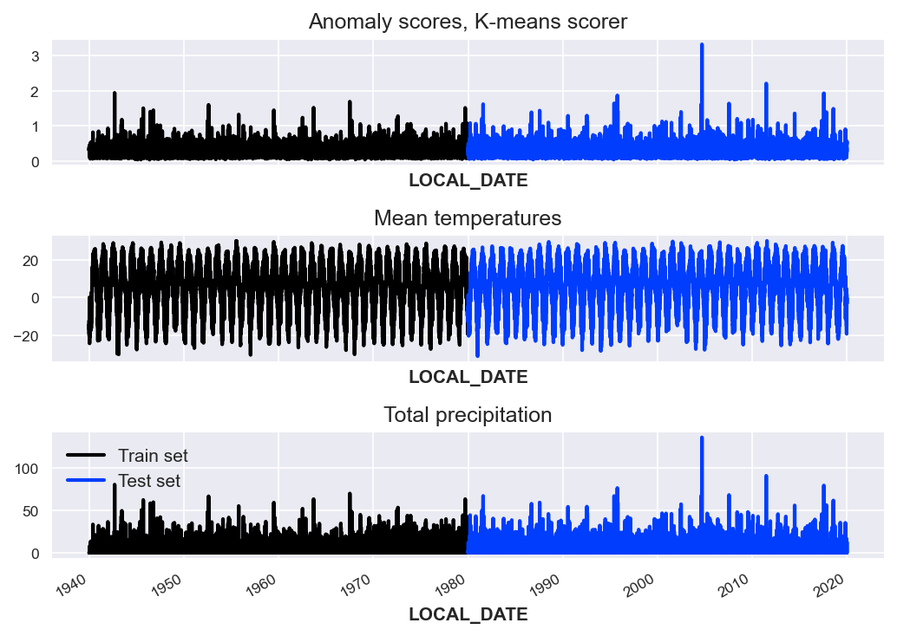

``` python
# Detections plot
plot_detection("K-means scores", q, ts_ottawa, scores_kmeans, anoms_kmeans)
```

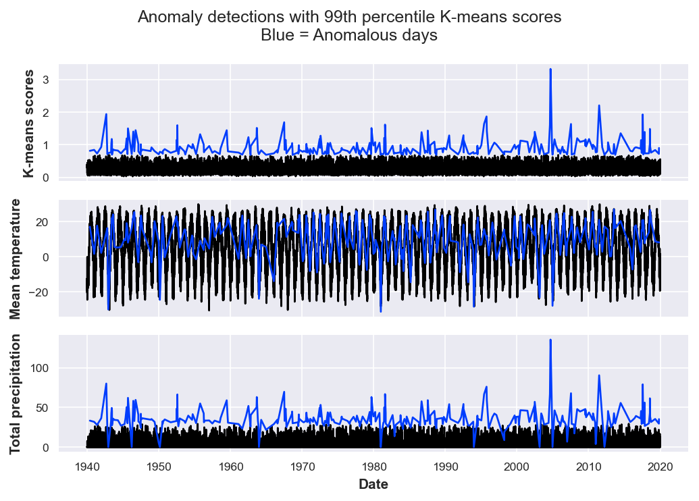

``` python
# Plot distributions of anomaly scores
plot_dist("K-means scorer", scores_train_kmeans, scores_test_kmeans)
```

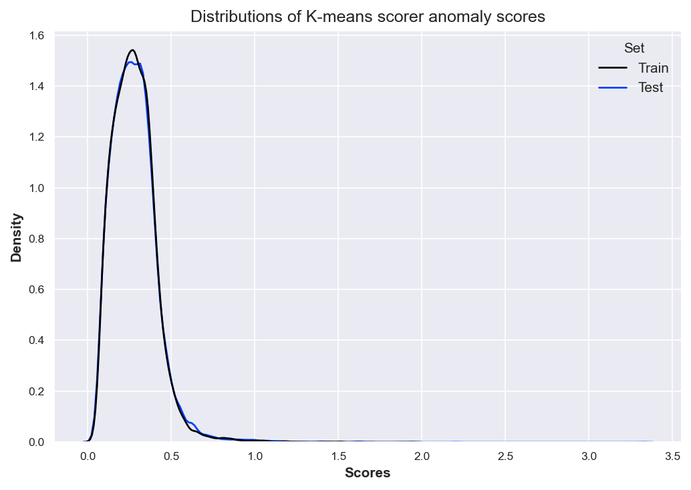

``` python
# 3D anomalies plot
plot_anom3d(
  "K-means scorer", ts_ottawa, anoms_kmeans, px_width, px_height, html = True)
```

<details>
<summary>Show code for 3D clustering plot</summary>

``` python
# Clustering plot
train_labels = scorer_kmeans.model.labels_.astype(str)
fig = px.scatter_3d(
  x = ts_train['MEAN_TEMPERATURE_OTTAWA'].univariate_values(),
  y = ts_train['TOTAL_PRECIPITATION_OTTAWA'].univariate_values(),
  z = ts_train.time_index.month,
  color = train_labels,
  title = "K-Means clustering plot, train set",
  labels = {
    "x": "Mean temperature",
    "y": "Total precipitation",
    "z": "Month",
    "color": "Clusters"},
    width = px_width,
    height = px_height
)
fig.write_html("./HtmlPlot/plot.html", include_plotlyjs = "cdn")
IFrame(src="./HtmlPlot/plot.html", width=800, height=600)
```

</details>

        <iframe
            width="800"
            height="600"
            src="./HtmlPlot/plot.html"
            frameborder="0"
            allowfullscreen
            
        ></iframe>
        

### Gaussian mixture models (GMM)

``` python
# Create PyOD GMM model
gmm = GMM(
  n_components = 4, # N. of Gaussian mixture components
  n_init = 10, # N. of initializations for expectation maximization
  contamination = 0.01, # % of expected anomalies in the dataset
  random_state = 1923)
  
# Create Darts GMM scorer  
scorer_gmm = PyODScorer(model = gmm, window = 1)
```

<details>
<summary>Show code for GMM anomaly detection</summary>

``` python
# Perform anomaly scoring
scores_train_gmm, scores_test_gmm, scores_gmm = score(
  ts_train, ts_test, scorer_gmm, scaler)

# Perform anomaly detection
anoms_train_gmm, anoms_test_gmm, anoms_gmm = detect(
  scores_train_gmm, scores_test_gmm, detector)

# Plot scores & original series
plot_series("GMM scorer", ts_train, ts_test, scores_train_gmm, scores_test_gmm)

# Detections plot
plot_detection("GMM scores", q, ts_ottawa, scores_gmm, anoms_gmm)

# Plot distributions of anomaly scores
plot_dist("GMM scorer", scores_train_gmm, scores_test_gmm)

# 3D anomalies plot
plot_anom3d("GMM scorer", ts_ottawa, anoms_gmm, px_width, px_height, html = True)

# 3D cluster plot
labels = scorer_gmm.model.detector_.predict(
  scaler.transform(ts_ottawa).values()).astype(str)
fig = px.scatter_3d(
  x = ts_ottawa['MEAN_TEMPERATURE_OTTAWA'].univariate_values(),
  y = ts_ottawa['TOTAL_PRECIPITATION_OTTAWA'].univariate_values(),
  z = ts_ottawa.time_index.month,
  color = labels,
  title = "GMM clustering plot",
  labels = {
    "x": "Mean temperature",
    "y": "Total precipitation",
    "z": "Month",
    "color": "Clusters"},
    width = px_width,
    height = px_height
)
fig.write_html("./HtmlPlot/plot.html", include_plotlyjs = "cdn")
IFrame(src="./HtmlPlot/plot.html", width=800, height=600)
```

</details>

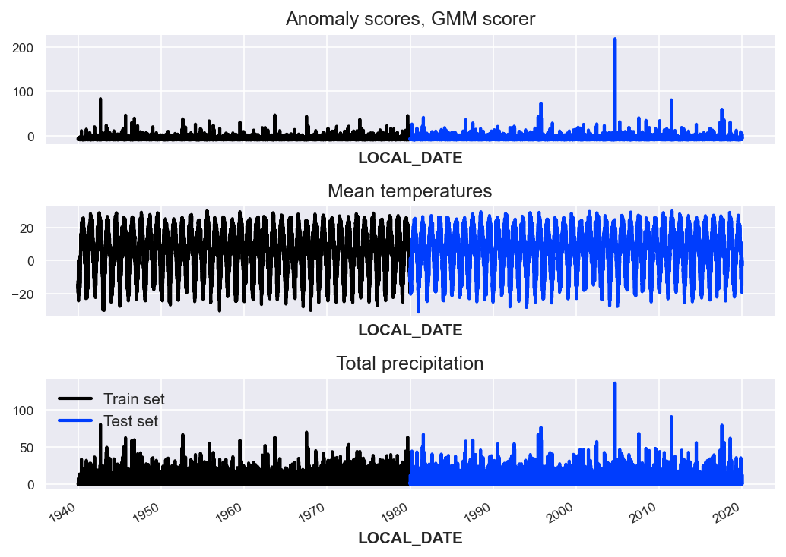

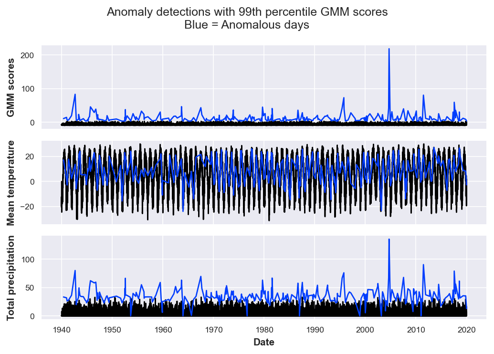

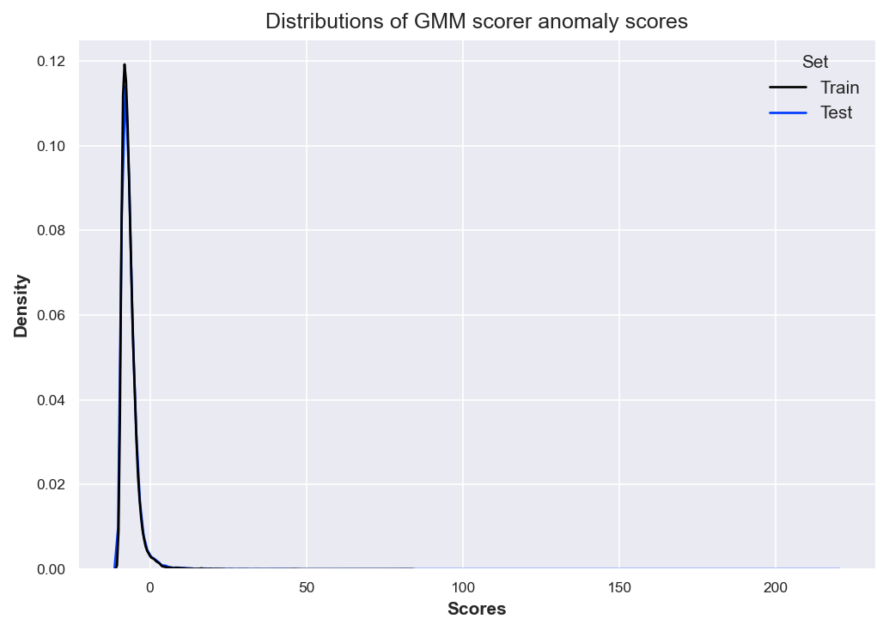

        <iframe
            width="800"
            height="600"
            src="./HtmlPlot/plot.html"
            frameborder="0"
            allowfullscreen
            
        ></iframe>
        

### ECOD

``` python
# Create ECOD scorer
ecod = ECOD(contamination = 0.01)
scorer_ecod = PyODScorer(model = ecod, window = 1)
```

<details>
<summary>Show code for ECOD anomaly detection</summary>

``` python
# Perform anomaly scoring
scores_train_ecod, scores_test_ecod, scores_ecod = score(
  ts_train, ts_test, scorer_ecod)

# Perform anomaly detection
anoms_train_ecod, anoms_test_ecod, anoms_ecod = detect(
  scores_train_ecod, scores_test_ecod, detector)

# Plot scores & original series
plot_series("ECOD scorer", ts_train, ts_test, scores_train_ecod, scores_test_ecod)

# Detections plot
plot_detection("ECOD scores", q, ts_ottawa, scores_ecod, anoms_ecod)

# Plot distributions of anomaly scores
plot_dist("ECOD scorer", scores_train_ecod, scores_test_ecod)

# 3D anomalies plot
plot_anom3d("ECOD scorer", ts_ottawa, anoms_ecod, px_width, px_height, html = True)
```

</details>

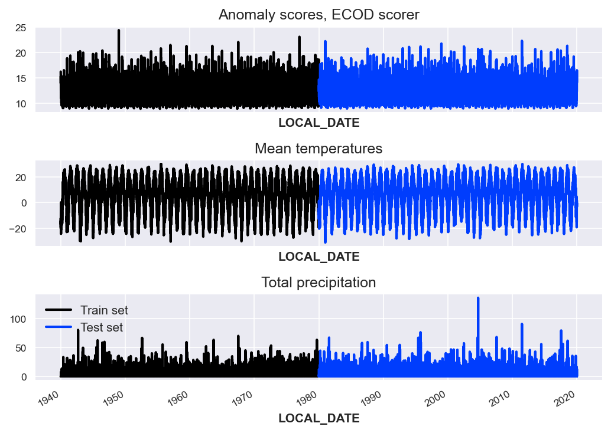

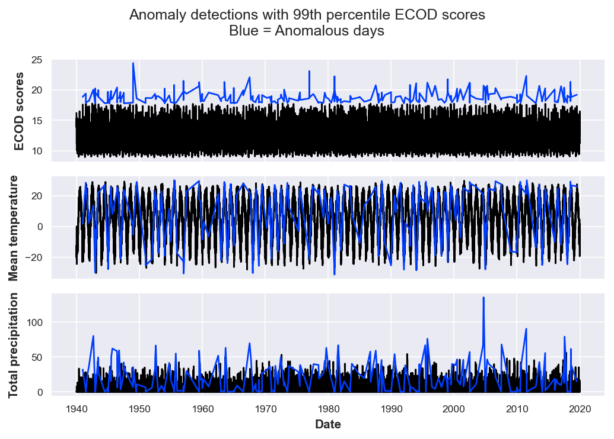

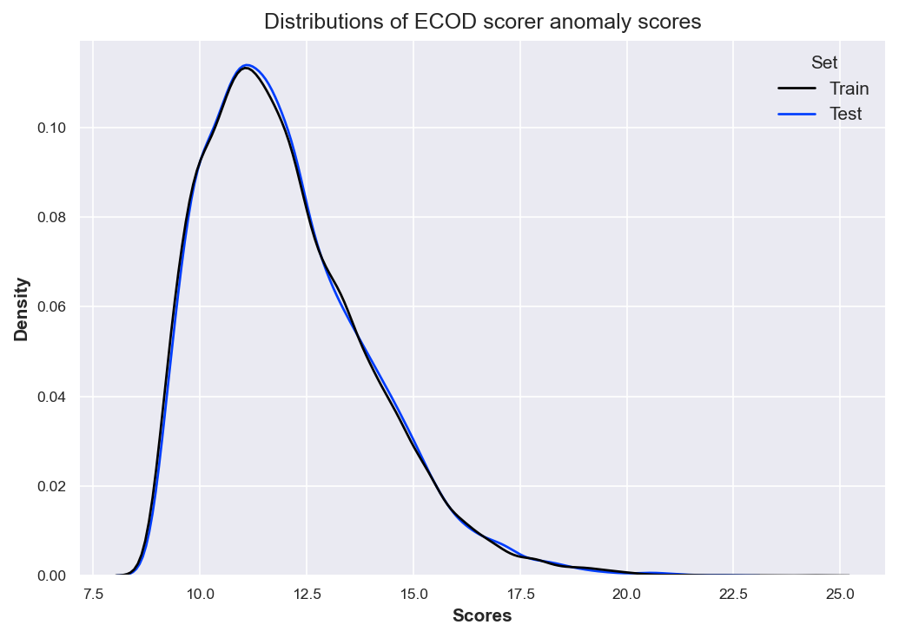

``` python
# Special to scorer: Explain a single training point's outlier scoring
idx_max_precip = np.argmax(
  ts_train['TOTAL_PRECIPITATION_OTTAWA'].univariate_values())
scorer_ecod.model.explain_outlier(
  ind = idx_max_precip, # Index of point to explain
  columns = [1, 2, 3, 4], # Dimensions to explain
  feature_names = ["MeanTemp", "TotalPrecip", "MonthSin", "MonthCos"])
plt.close("all")
```

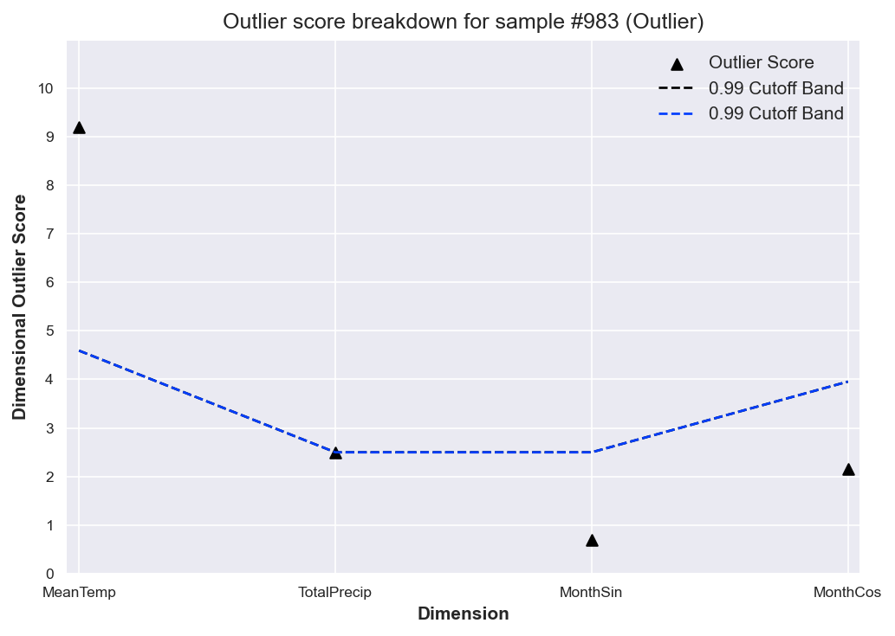

### Principal components analysis (PCA)

``` python
# Create PCA scorer
pca = PCA(contamination = 0.01, standardization = True, random_state = 1923)
scorer_pca = PyODScorer(model = pca, window = 1)
```

<details>
<summary>Show code for PCA anomaly detection</summary>

``` python
# Perform anomaly scoring
scores_train_pca, scores_test_pca, scores_pca = score(
  ts_train, ts_test, scorer_pca)

# Perform anomaly detection
anoms_train_pca, anoms_test_pca, anoms_pca = detect(
  scores_train_pca, scores_test_pca, detector)

# Plot scores & original series
plot_series("PCA scorer", ts_train, ts_test, scores_train_pca, scores_test_pca)

# Detections plot
plot_detection("PCA scores", q, ts_ottawa, scores_pca, anoms_pca)

# Plot distributions of anomaly scores
plot_dist("PCA scorer", scores_train_pca, scores_test_pca)

# 3D anomalies plot
plot_anom3d("PCA scorer", ts_ottawa, anoms_pca, px_width, px_height, html = True)
```

</details>

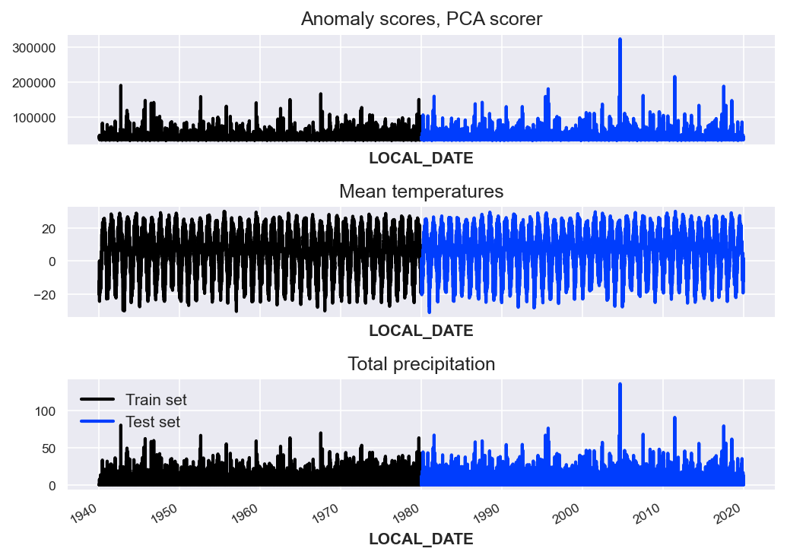

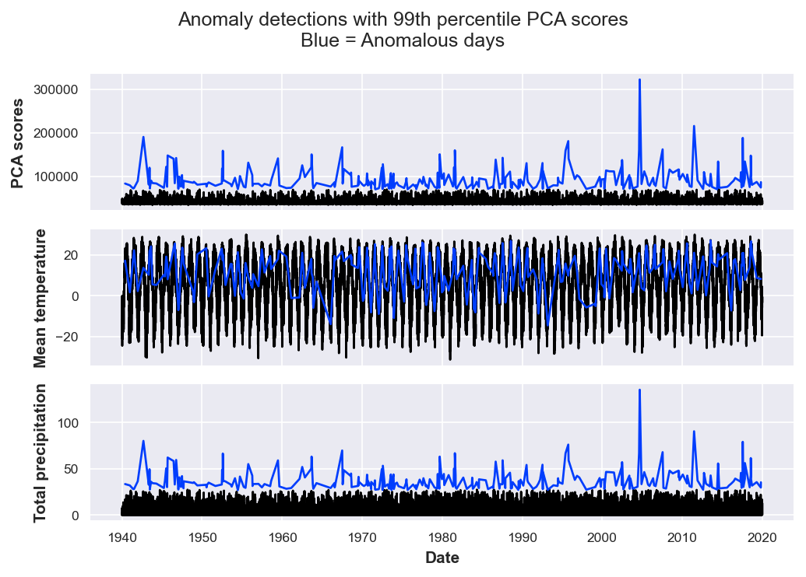

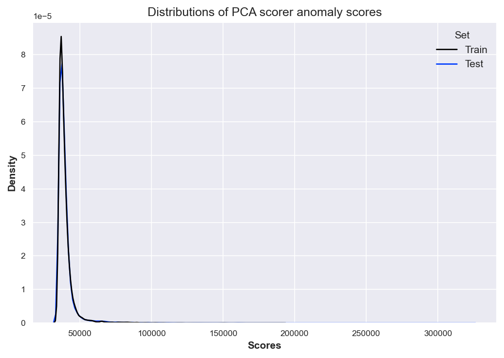

#### PC & T-SNE plots

``` python
# Variances explained by each component: First 3 PCs explain almost 99%
pc_variances = scorer_pca.model.explained_variance_ratio_ * 100
pc_variances = [round(x, 2) for x in pc_variances]
pc_variances
```

    [48.22, 37.31, 12.49, 1.56, 0.19, 0.19, 0.02, 0.01]

<details>
<summary>Show code to generate PC loadings heatplot</summary>

``` python
# Heatplot of PC loadings, X = PCs, Y = Features's contribution to the PCs
pc_loadings = pd.DataFrame(
  scorer_pca.model.components_.T,
  columns = pc_variances,
  index = ts_ottawa.components)
_ = sns.heatmap(pc_loadings, cmap = "PiYG")
_ = plt.title("PC loadings")
_ = plt.xlabel("% variances explained by PCs")
_ = plt.ylabel("Features")
plt.show()
plt.close("all")
```

</details>


<details>
<summary>Show code to generate 3D PC plots</summary>

``` python
# Transform data into PC values
pcs = scorer_pca.model.detector_.transform(
  scorer_pca.model.scaler_.transform(ts_ottawa.values())
  )

# Principal components plot, first 3 PCs  
fig = px.scatter_3d(
  x = pcs[:, 0],
  y = pcs[:, 1],
  z = pcs[:, 2],
  color = anoms_pca.univariate_values().astype(str),
  title = "PCA components plot, first 3 PCs",
  labels = {
    "x": "PC1",
    "y": "PC2",
    "z": "PC3",
    "color": "Anomaly labels"},
    width = px_width,
    height = px_height
)
fig.write_html("./HtmlPlot/plot.html", include_plotlyjs = "cdn")
IFrame(src="./HtmlPlot/plot.html", width=800, height=600)


# Principal components plot, PC3-4-5
fig = px.scatter_3d(
  x = pcs[:, 4],
  y = pcs[:, 3],
  z = pcs[:, 2],
  color = anoms_pca.univariate_values().astype(str),
  title = "PCA components plot, middle 3 PCs",
  labels = {
    "x": "PC5",
    "y": "PC4",
    "z": "PC3",
    "color": "Anomaly labels"},
    width = px_width,
    height = px_height
)
fig.write_html("./HtmlPlot/plot.html", include_plotlyjs = "cdn")
IFrame(src="./HtmlPlot/plot.html", width=800, height=600)


# # Principal components plot, last 3 PCs
# fig = px.scatter_3d(
#   x = pcs[:, -1],
#   y = pcs[:, -2],
#   z = pcs[:, -3],
#   color = anoms_pca.univariate_values().astype(str),
#   title = "PCA components plot, last 3 PCs",
#   labels = {
#     "x": "PC6",
#     "y": "PC7",
#     "z": "PC8",
#     "color": "Anomaly labels"},
#     width = px_width,
#     height = px_height
# )
# fig.write_html("./HtmlPlot/plot.html", include_plotlyjs = "cdn")
# IFrame(src="./HtmlPlot/plot.html", width=800, height=600)
```

</details>

        <iframe
            width="800"
            height="600"
            src="./HtmlPlot/plot.html"
            frameborder="0"
            allowfullscreen
            
        ></iframe>
        
<details>
<summary>Show code to generate 3D T-SNE plot</summary>

``` python
# Standardize & normalize PCs
std_scaler = StandardScaler()
pcs_scaled = std_scaler.fit_transform(pcs)

# Apply T-SNE to PCs
tsne = TSNE(n_components = 3)
z_pca = tsne.fit_transform(pcs_scaled)

# T-SNE dimensions plot
fig = px.scatter_3d(
  x = z_pca[:, 0],
  y = z_pca[:, 1],
  z = z_pca[:, 2],
  color = anoms_pca.univariate_values().astype(str),
  title = "PCA components plot, 3D T-SNE reduction",
  labels = {
    "x": "Dim1",
    "y": "Dim2",
    "z": "Dim3",
    "color": "Anomaly labels"},
    width = px_width,
    height = px_height
)
fig.write_html("./HtmlPlot/plot.html", include_plotlyjs = "cdn")
IFrame(src="./HtmlPlot/plot.html", width=800, height=600)
```

</details>

        <iframe
            width="800"
            height="600"
            src="./HtmlPlot/plot.html"
            frameborder="0"
            allowfullscreen
            
        ></iframe>
        

### Isolation forest

``` python
# Create IForest scorer
iforest = IForest(
  n_estimators= 500, # N. of trees in forest
  contamination = 0.01,
  random_state = 1923)
scorer_iforest = PyODScorer(model = iforest, window = 1)
```

<details>
<summary>Show code for IForest anomaly detection</summary>

``` python
# Perform anomaly scoring
scores_train_iforest, scores_test_iforest, scores_iforest = score(
  ts_train, ts_test, scorer_iforest)

# Perform anomaly detection
anoms_train_iforest, anoms_test_iforest, anoms_iforest = detect(
  scores_train_iforest, scores_test_iforest, detector)

# Plot scores & original series
plot_series(
  "IForest scorer", ts_train, ts_test, scores_train_iforest, scores_test_iforest)

# Detections plot
plot_detection("IForest scores", q, ts_ottawa, scores_iforest, anoms_iforest)

# Plot distributions of anomaly scores
plot_dist("IForest scorer", scores_train_iforest, scores_test_iforest)

# 3D anomalies plot
plot_anom3d(
  "IForest scorer", ts_ottawa, anoms_iforest, px_width, px_height, html = True)
```

</details>

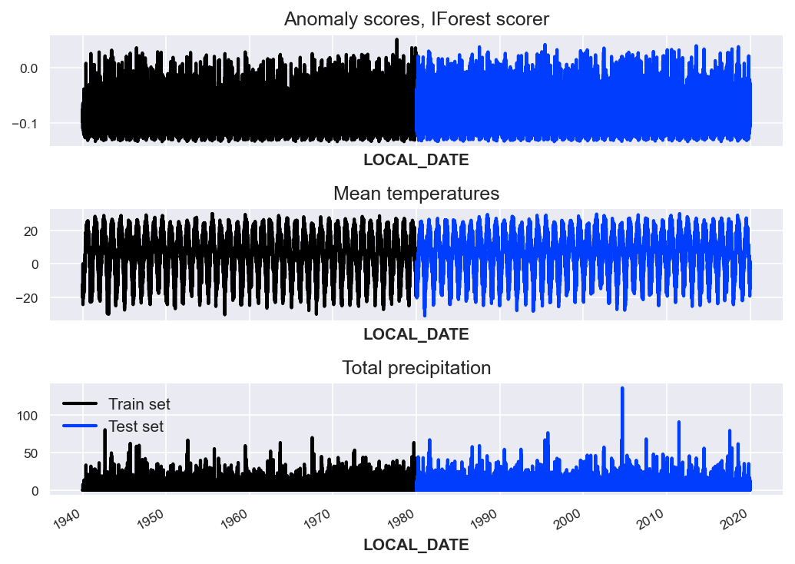

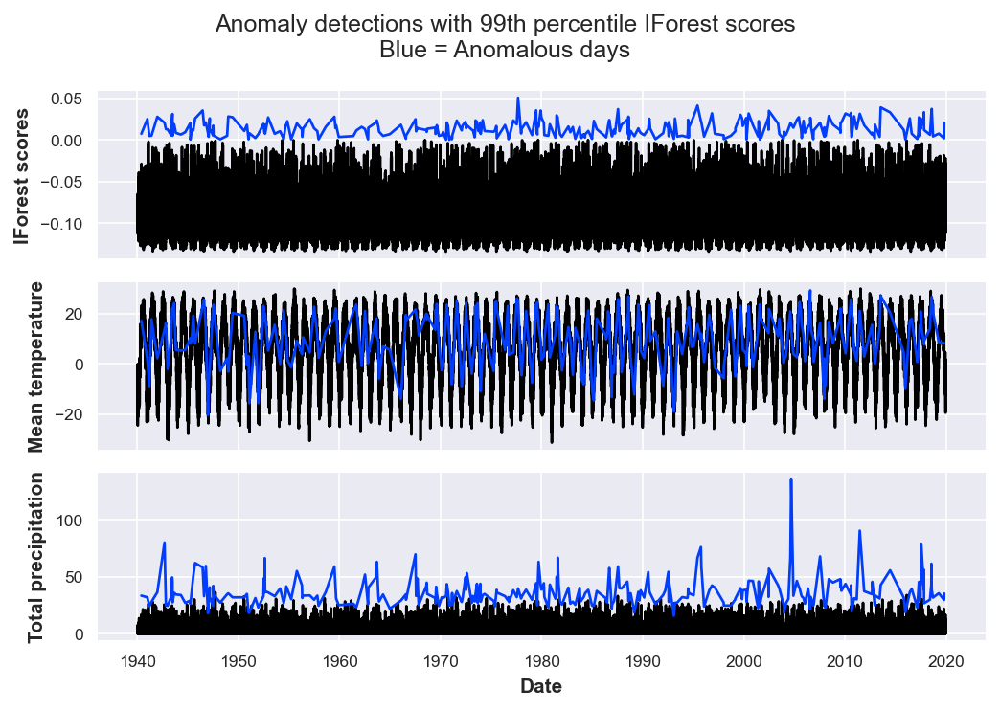

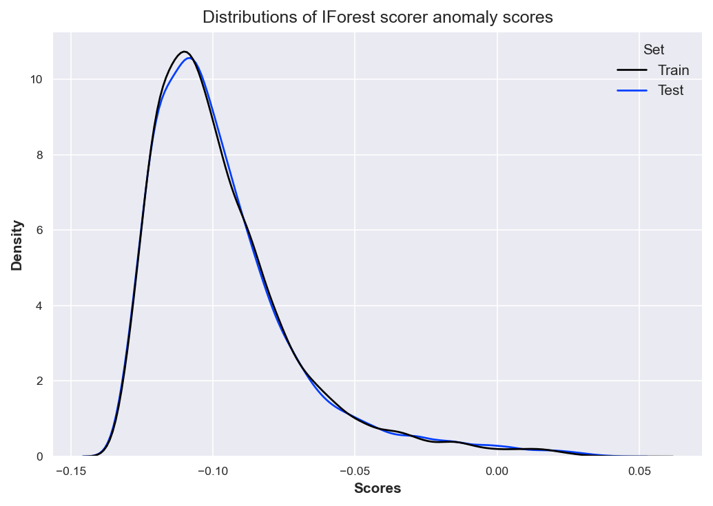

<details>
<summary>Show code to plot IForest feature importances</summary>

``` python
# Feature importances (can be misleading for high cardinality features, e.g. day
# and week features)
feat_imp = pd.DataFrame({
  "Feature importance": scorer_iforest.model.feature_importances_,
  "Feature": ts_ottawa.components
}).sort_values("Feature importance", ascending = False)
_ = sns.barplot(data = feat_imp, x = "Feature importance", y = "Feature")
plt.show()
plt.close("all")
```

</details>

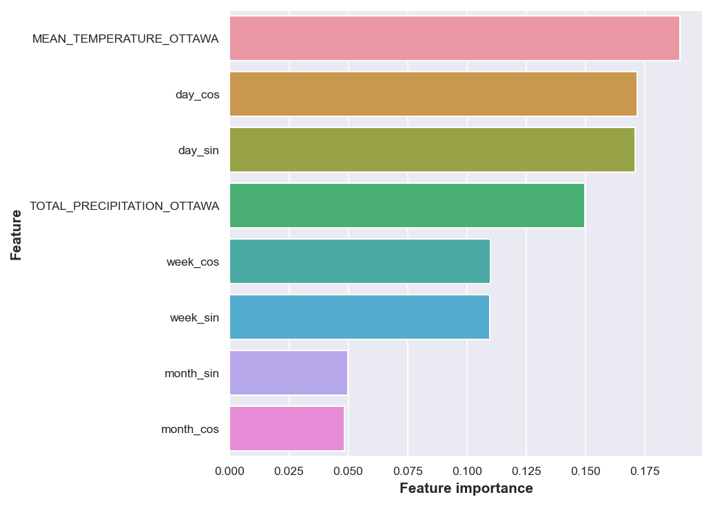

### Autoencoder with PyTorch Lightning

#### Hyperparameter tuning

<details>
<summary>Show code to tune Autoencoder hyperparameters</summary>

``` python
# Split train - val data
val_start = pd.Timestamp("1970-01-01")
train_end = pd.Timestamp("1969-12-31")
ts_tr = ts_train.drop_after(val_start)
ts_val = ts_train.drop_before(train_end)

 # Perform preprocessing for train - validation split
x_tr = std_scaler.fit_transform(ts_tr.values())
x_val = std_scaler.transform(ts_val.values())

# Load data into TrainDataset
train_data = TrainDataset(x_tr)
val_data = TrainDataset(x_val)

# Create data loaders
train_loader = torch.utils.data.DataLoader(
      train_data, batch_size = 128, num_workers = 0, shuffle = True)
val_loader = torch.utils.data.DataLoader(
      val_data, batch_size = len(ts_val), num_workers = 0, shuffle = False)


# Define Optuna objective
def objective_nn(trial, train_loader, val_loader):

  # Define parameter ranges to tune over & suggest param set for trial
  hidden_size = trial.suggest_int("hidden_size", 2, 6, step = 2)
  latent_size = trial.suggest_int("latent_size", 1, (hidden_size - 1))
  learning_rate = trial.suggest_float("learning_rate", 5e-4, 5e-2)
  dropout = trial.suggest_float("dropout", 1e-4, 0.2)

  # Create hyperparameters dict
  hyperparams_dict = {
      "input_size": ts_train.values().shape[1],
      "hidden_size": hidden_size,
      "latent_size": latent_size,
      "learning_rate": learning_rate,
      "dropout": dropout}

  # Validate hyperparameter set
  score, epoch = validate_nn(hyperparams_dict, train_loader, val_loader, trial)

  # Report best n. of epochs
  trial.set_user_attr("n_epochs", epoch)

  return score


# Create study
study_nn = optuna.create_study(
  sampler = optuna.samplers.TPESampler(seed = 1923),
  pruner = optuna.pruners.HyperbandPruner(),
  study_name = "tune_nn",
  direction = "minimize"
)

# Instantiate objective
obj = lambda trial: objective_nn(trial, train_loader, val_loader)

# Optimize study
study_nn.optimize(obj, n_trials = 500, show_progress_bar = True)

# Retrieve and export trials
trials_nn = study_nn.trials_dataframe().sort_values("value", ascending = True)
trials_nn.to_csv("./OutputData/trials_nnX.csv", index = False)
```

</details>

#### Anomaly detection

<details>
<summary>Show code to train & predict with Autoencoder model</summary>

``` python
# Import best trial
best_trial_nn = pd.read_csv("./OutputData/trials_nn1.csv").iloc[0,]

# Retrieve best hyperparameters
hyperparams_dict = {
      "input_size": ts_train.values().shape[1],
      "hidden_size": best_trial_nn["params_hidden_size"],
      "latent_size": best_trial_nn["params_latent_size"],
      "learning_rate": best_trial_nn["params_learning_rate"],
      "dropout": best_trial_nn["params_dropout"]}


# Perform preprocessing
x_train = std_scaler.fit_transform(ts_train.values())
x_test = std_scaler.transform(ts_test.values())

# Load data into TrainDataset & TestDataset
train_data = TrainDataset(x_train)
test_data = TestDataset(x_test)
train_score_data = TestDataset(x_train)

# Create data loaders
train_loader = torch.utils.data.DataLoader(
      train_data, batch_size = 128, num_workers = 0, shuffle = True)
test_loader = torch.utils.data.DataLoader(
      test_data, batch_size = len(ts_test), num_workers = 0, shuffle = False)
train_score_loader = torch.utils.data.DataLoader(
      train_score_data, batch_size = len(ts_train), num_workers = 0, shuffle = False)


# Create trainer
trainer = L.Trainer(
    max_epochs = int(best_trial_nn["user_attrs_n_epochs"]),
    accelerator = "gpu", devices = "auto", precision = "16-mixed",
    enable_model_summary = True,
    logger = True,
    enable_progress_bar = True,
    enable_checkpointing = True
    )

# Create & train model
model = AutoEncoder(hyperparams_dict = hyperparams_dict)
trainer.fit(model, train_loader)

# Perform reconstructions of training & testing data
preds_train = trainer.predict(
  model, train_score_loader)[0].cpu().numpy().astype(np.float64)
preds_test = trainer.predict(
  model, test_loader)[0].cpu().numpy().astype(np.float64)
```

</details>

    Training: 0it [00:00, ?it/s]

    Predicting: 0it [00:00, ?it/s]

    Predicting: 0it [00:00, ?it/s]

<details>
<summary>Show code to get reconstruction errors</summary>

``` python
# Perform anomaly scoring: Get mean reconstruction error for each datapoint

# Train set
scores_train = np.abs(x_train - preds_train) # Absolute errors of each dimensions
scores_train = np.mean(scores_train, axis = 1) # Mean absolute error over all dimensions
scores_train = pd.DataFrame(scores_train, index = ts_train.time_index) # Dataframe with corresponding dates
scores_train = TimeSeries.from_dataframe(scores_train) # Darts TS
scores_train = scores_train.with_columns_renamed("0", "Scores")

# Test set
scores_test = np.abs(x_test - preds_test)
scores_test = np.mean(scores_test, axis = 1) 
scores_test = pd.DataFrame(scores_test, index = ts_test.time_index)
scores_test = TimeSeries.from_dataframe(scores_test)
scores_test = scores_test.with_columns_renamed("0", "Scores")
scores = scores_train.append(scores_test)
```

</details>
<details>
<summary>Show code for Autoencoder anomaly detection</summary>

``` python
# Perform anomaly detection
anoms_train, anoms_test, anoms = detect(scores_train, scores_test, detector)

# Plot scores & original series
plot_series("Autoencoder scorer", ts_train, ts_test, scores_train, scores_test)

# Detections plot
plot_detection("Autoencoder scores", q, ts_ottawa, scores, anoms)

# Plot distributions of anomaly scores
plot_dist("Autoencoder scorer", scores_train, scores_test)

# 3D anomalies plot
plot_anom3d(
  "Autoencoder scorer", ts_ottawa, anoms, px_width, px_height, html = True)
```

</details>

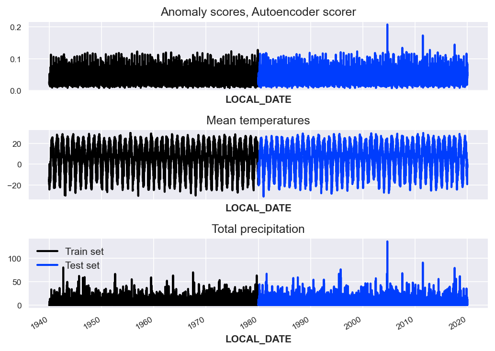

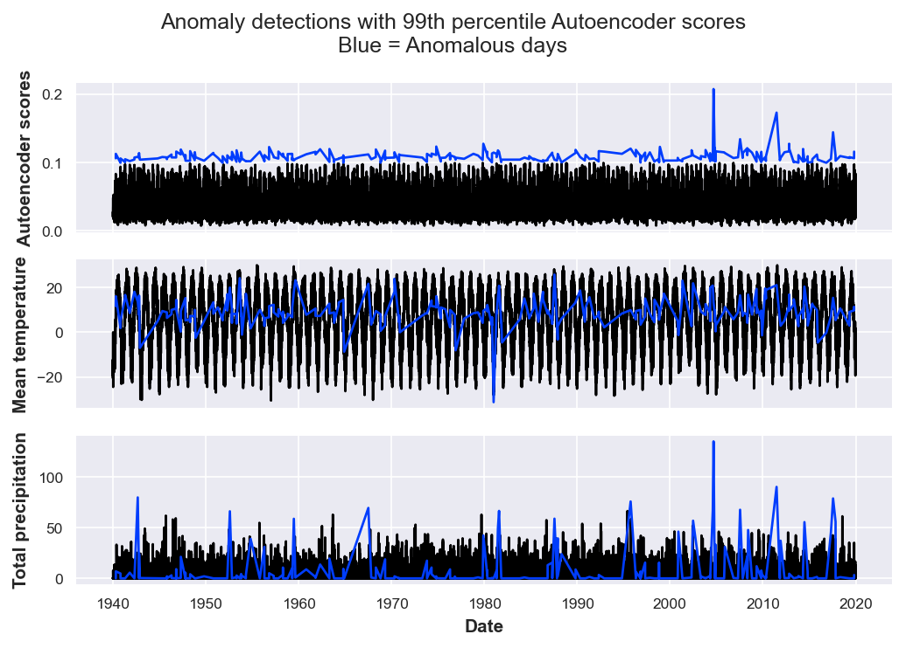

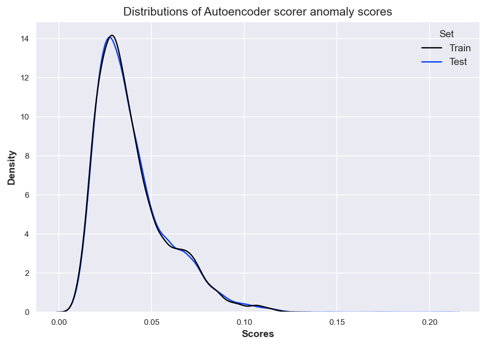

#### Latent space plot with T-SNE

<details>
<summary>Show code to generate 3D T-SNE plot</summary>

``` python
# Define function to get latent space representations
def get_latent(model, dataloader):
  model.eval() # Put model into inference mode
  with torch.no_grad(): # Disable gradient calculation
    z = [model.forward(x) for _, x in enumerate(dataloader)]
    return z[0].cpu().numpy().astype(np.float64)

# Retrieve & concatenate latent space representations
z_train = get_latent(model, train_score_loader)
z_test = get_latent(model, test_loader)
z = np.concatenate((z_train, z_test), axis = 0)


# Apply T-SNE to latent space
z_scaled = std_scaler.fit_transform(z)
z_autoencoder = tsne.fit_transform(z_scaled)


# Latent space plot
fig = px.scatter_3d(
  x = z_autoencoder[:, 0],
  y = z_autoencoder[:, 1],
  z = z_autoencoder[:, 2],
  color = anoms.univariate_values().astype(str),
  title = "Autoencoder latent space plot, 3D T-SNE reduction",
  labels = {
    "x": "Dim1",
    "y": "Dim2",
    "z": "Dim3",
    "color": "Anomaly labels"},
    width = px_width,
    height = px_height
)
fig.write_html("./HtmlPlot/plot.html", include_plotlyjs = "cdn")
IFrame(src="./HtmlPlot/plot.html", width=800, height=600)
```

</details>

        <iframe
            width="800"
            height="600"
            src="./HtmlPlot/plot.html"
            frameborder="0"
            allowfullscreen
            
        ></iframe>
        

## Conclusion
