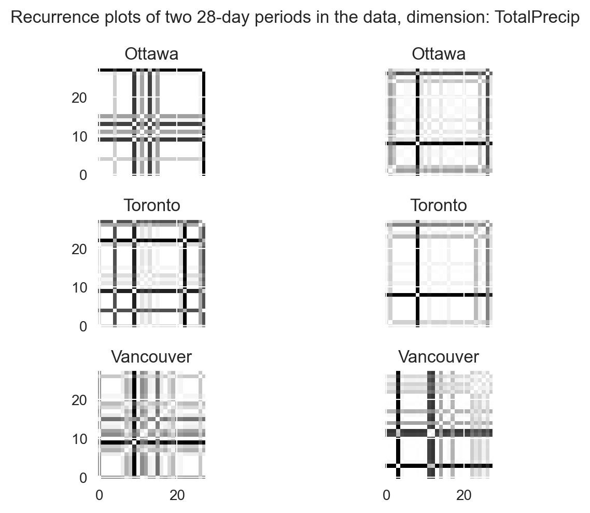

Time series classification - Canadian weather data
================
Ahmet Zamanis

- <a href="#introduction" id="toc-introduction">Introduction</a>
- <a href="#data-preparation" id="toc-data-preparation">Data
  preparation</a>
  - <a href="#recurrence-plot-transformations"
    id="toc-recurrence-plot-transformations">Recurrence plot
    transformations</a>
- <a href="#time-series-classification"
  id="toc-time-series-classification">Time series classification</a>
  - <a href="#k-nearest-neighbors-with-dtw-distance"
    id="toc-k-nearest-neighbors-with-dtw-distance">K-nearest neighbors with
    DTW distance</a>
  - <a href="#rocket-arsenal" id="toc-rocket-arsenal">ROCKET &amp;
    Arsenal</a>
  - <a href="#muse" id="toc-muse">MUSE</a>
  - <a href="#convolutional-neural-network-with-recurrence-plots"
    id="toc-convolutional-neural-network-with-recurrence-plots">Convolutional
    neural network with recurrence plots</a>
- <a href="#performance-comparison"
  id="toc-performance-comparison">Performance comparison</a>
  - <a href="#metrics-table" id="toc-metrics-table">Metrics table</a>
  - <a href="#confusion-matrix-plots"
    id="toc-confusion-matrix-plots">Confusion matrix plots</a>
- <a href="#conclusion" id="toc-conclusion">Conclusion</a>

## Introduction

In time series classification, the goal is to predict the class label
attributed to an entire time series rather than a single observation. A
common example is classifying ECG readings as normal and abnormal, or
predicting whether a machine is faulty from a sequence of sensor
readings.

In this report, we’ll take multivariate sequences of weather
measurements from several locations, and try to predict which location
these sequences were observed in. We’ll test and compare several time
series classifiers from the [sktime](https://github.com/sktime/sktime)
package. We’ll also try the method of transforming our time series into
images (with the [pyts](https://github.com/johannfaouzi/pyts) package)
and classifying the images with a convolutional neural network built in
PyTorch Lightning.

The data consists of daily mean temperature and total precipitation
measurements across 13 Canadian locations, some ranging from 1940 to
2020, others starting from 1960. The data was downloaded from
[OpenML](https://openml.org/search?type=data&status=active&id=43843&sort=runs),
shared by user Elif Ceren Gök.

The Python scripts for this analysis are available on the [GitHub
repository](https://github.com/AhmetZamanis/WeatherAnomalyDetectionClassification).
They may not be fully up to date with the report.

<details>
<summary>Show imports</summary>

``` python
# Data handling
import pandas as pd
import numpy as np
import arff # Installed as liac-arff
import warnings

# Plotting
import matplotlib.pyplot as plt
import seaborn as sns

# PyTorch Lightning & Optuna
import torch
import lightning as L
import optuna

# Time series classifiers
from sktime.classification.distance_based import KNeighborsTimeSeriesClassifier
from sktime.classification.kernel_based import RocketClassifier, Arsenal
from sktime.classification.dictionary_based import MUSE

# Transformations
from pyts.image import RecurrencePlot
from sklearn.preprocessing import OneHotEncoder

# Performance metrics
from sklearn.metrics import accuracy_score, log_loss, confusion_matrix

# Custom Lightning classes
from X_LightningClassesClassif import TrainDataset, TestDataset, CNN, OptunaPruning

# Helper functions
from X_HelperFunctionsClassif import plot_confusion, scale_dims, get_images, plot_images, validate_cnn, test_model
```

</details>
<details>
<summary>Show settings</summary>

``` python
# Set print options
np.set_printoptions(suppress=True, precision=4)
pd.options.display.float_format = '{:.4f}'.format
pd.set_option('display.max_columns', None)

# Set plotting options
plt.rcParams['figure.dpi'] = 200
plt.rcParams['savefig.dpi'] = 200
plt.rcParams["figure.autolayout"] = True
sns.set_style("darkgrid")

# Set Torch settings
torch.set_default_dtype(torch.float32)
torch.set_float32_matmul_precision('high')
L.seed_everything(1923, workers = True)
warnings.filterwarnings("ignore", ".*does not have many workers.*")
```

</details>

## Data preparation

The data is in .arff format, and we’ll use the
[liac-arff](https://github.com/renatopp/liac-arff) package to read it.
We have daily mean temperature and total precipitation values for each
of the 13 locations.

``` python
# Load raw data
raw_data = arff.load(open("./InputData/canadian_climate.arff", "r"))

# Convert to pandas dataframe & view
df = pd.DataFrame(
  raw_data["data"], columns = [x[0] for x in raw_data["attributes"]])
print(df.iloc[:,0:4])
```

                     LOCAL_DATE  MEAN_TEMPERATURE_CALGARY  \
    0      01-Jan-1940 00:00:00                  -11.4000   
    1      02-Jan-1940 00:00:00                  -12.0000   
    2      03-Jan-1940 00:00:00                  -12.0000   
    3      04-Jan-1940 00:00:00                  -11.4000   
    4      05-Jan-1940 00:00:00                  -13.1000   
    ...                     ...                       ...   
    29216  28-Dec-2019 00:00:00                   -7.7000   
    29217  29-Dec-2019 00:00:00                   -3.3000   
    29218  30-Dec-2019 00:00:00                   -1.6000   
    29219  31-Dec-2019 00:00:00                    4.3000   
    29220  01-Jan-2020 00:00:00                   -0.3000   

           TOTAL_PRECIPITATION_CALGARY  MEAN_TEMPERATURE_EDMONTON  
    0                           0.5000                        NaN  
    1                           0.5000                        NaN  
    2                           1.0000                        NaN  
    3                           0.8000                        NaN  
    4                           0.5000                        NaN  
    ...                            ...                        ...  
    29216                       0.0000                   -10.4000  
    29217                       0.0000                    -8.6000  
    29218                       0.0000                   -10.3000  
    29219                       0.0000                    -2.6000  
    29220                       0.0000                    -4.0000  

    [29221 rows x 4 columns]

``` python
# Check missing values
pd.isnull(df).sum()
```

    LOCAL_DATE                           0
    MEAN_TEMPERATURE_CALGARY           189
    TOTAL_PRECIPITATION_CALGARY        173
    MEAN_TEMPERATURE_EDMONTON         7657
    TOTAL_PRECIPITATION_EDMONTON      7646
    MEAN_TEMPERATURE_HALIFAX          7164
    TOTAL_PRECIPITATION_HALIFAX       7226
    MEAN_TEMPERATURE_MONCTON          2336
    TOTAL_PRECIPITATION_MONCTON       2767
    MEAN_TEMPERATURE_MONTREAL          755
    TOTAL_PRECIPITATION_MONTREAL       730
    MEAN_TEMPERATURE_OTTAWA             76
    TOTAL_PRECIPITATION_OTTAWA          81
    MEAN_TEMPERATURE_QUEBEC           1214
    TOTAL_PRECIPITATION_QUEBEC        1227
    MEAN_TEMPERATURE_SASKATOON        2473
    TOTAL_PRECIPITATION_SASKATOON     3755
    MEAN_TEMPERATURE_STJOHNS           808
    TOTAL_PRECIPITATION_STJOHNS        822
    MEAN_TEMPERATURE_TORONTO            74
    TOTAL_PRECIPITATION_TORONTO         80
    MEAN_TEMPERATURE_VANCOUVER          53
    TOTAL_PRECIPITATION_VANCOUVER       55
    MEAN_TEMPERATURE_WHITEHORSE       1691
    TOTAL_PRECIPITATION_WHITEHORSE    4095
    MEAN_TEMPERATURE_WINNIPEG          124
    TOTAL_PRECIPITATION_WINNIPEG       247
    dtype: int64

We’ll focus our attention on three of the pre-1960 locations: Ottawa,
Toronto and Vancouver. First we’ll long convert the data, and retrieve
the rows only for these three cities.

``` python
# Wide to long conversion
df = pd.wide_to_long(
  df, stubnames = ["MEAN_TEMPERATURE", "TOTAL_PRECIPITATION"],
  i = "LOCAL_DATE", j = "LOCATION", sep = "_", suffix = r"\w+")
df = df.reset_index()

# Select observations only for Ottawa, Toronto, Vancouver
df = df[df["LOCATION"].isin(["OTTAWA", "TORONTO", "VANCOUVER"])]

# Convert LOCAL_DATE to datetime, set index for NA interpolation
df["LOCAL_DATE"] = pd.to_datetime(df["LOCAL_DATE"])
df = df.set_index("LOCAL_DATE")

# View long data
print(df)
```

                 LOCATION  MEAN_TEMPERATURE  TOTAL_PRECIPITATION
    LOCAL_DATE                                                  
    1940-01-01     OTTAWA          -17.0000               0.0000
    1940-01-02     OTTAWA          -16.7000               0.5000
    1940-01-03     OTTAWA          -12.3000               0.0000
    1940-01-04     OTTAWA          -16.4000               0.0000
    1940-01-05     OTTAWA          -19.5000               0.0000
    ...               ...               ...                  ...
    2019-12-28  VANCOUVER            5.3000               3.0000
    2019-12-29  VANCOUVER            7.1000               2.4000
    2019-12-30  VANCOUVER            7.5000               5.8000
    2019-12-31  VANCOUVER            8.4000              21.2000
    2020-01-01  VANCOUVER            7.8000               0.8000

    [87663 rows x 3 columns]

We have a few missing weather measurements across the time period. We’ll
interpolate them with a simple method.

``` python
# Interpolate missing values in Ottawa, Toronto, Vancouver
df = df.groupby("LOCATION", group_keys = False).apply(
  lambda g: g.interpolate(method = "time"))
df = df.reset_index()
```

The daily mean temperature and total precipitation values will be our
weather variables. To predict the city of a sequence of weather
measurements, we’ll need to compare these variables with the dates they
were observed in.

- To this end, we’ll extract month, week of year and day of year
  features from our date column.

- We’ll use cyclical encoding to transform these categorical variables
  into numeric, while reflecting their cyclical nature to the algorithms
  we’ll use. This creates a pair of sine and cosine values for each time
  variable, resulting in a total of 8 variables per location.

``` python
# Add cyclic terms for month, week of year and day of year
df["month_sin"] = np.sin(2 * np.pi * df["LOCAL_DATE"].dt.month / 12)
df["month_cos"] = np.cos(2 * np.pi * df["LOCAL_DATE"].dt.month / 12)
df["week_sin"] = np.sin(2 * np.pi * df["LOCAL_DATE"].dt.isocalendar().week / 53)
df["week_cos"] = np.cos(2 * np.pi * df["LOCAL_DATE"].dt.isocalendar().week / 53)
df["day_sin"] = np.sin(2 * np.pi * df["LOCAL_DATE"].dt.dayofyear / 366)
df["day_cos"] = np.cos(2 * np.pi * df["LOCAL_DATE"].dt.dayofyear / 366)
```

We’ll split the data for each city into 28-day sequences. We’ll store
the data in a 3D numpy array, which is accepted as input by both sktime
and pyts.

<details>
<summary>Show code to split data into 28-day sequences</summary>

``` python
# Assign n as one less than the target sequence length
n = 27

# Add counter for days
df["DAYCOUNT"] = df.groupby("LOCATION").LOCATION.cumcount().add(1)

# Add rowgroups: A unique number for each n+1 day sequence
df["ROWGROUP"] = (df["DAYCOUNT"] // (n + 1)).astype(str)
df = df.drop("DAYCOUNT", axis = 1)


# Eliminate rowgroups which are not of length N + 1 per city
n_rowgroups = len(df["ROWGROUP"].unique())
rowgroup_lengths = [
  int(len(df[df["ROWGROUP"] == str(x)]) / 3) for x in range(0, n_rowgroups)]
rowgroups_to_keep = np.where(np.array(rowgroup_lengths) == n + 1)[0].tolist()
rowgroups_to_keep = [str(x) for x in rowgroups_to_keep]
df = df.loc[df["ROWGROUP"].isin(rowgroups_to_keep)]


# Retrieve targets for each sequence
y = df.groupby(["LOCATION", "ROWGROUP"]).head(1)["LOCATION"]
y = y.reset_index().drop("index", axis = 1).values.flatten()

# Get class labels
classes = np.unique(y)


# Retrieve features as 3Darray of shape (n_sequences, n_dimensions, seq_length)

# Get 2D arrays of (n_dimensions, seq_length) for each sequence
x = df.groupby(["LOCATION", "ROWGROUP"], as_index = False).apply(
    lambda g: np.array(
  [g["MEAN_TEMPERATURE"].values,
  g["TOTAL_PRECIPITATION"].values,
  g["month_sin"].values,
  g["month_cos"].values,
  g["week_sin"].values,
  g["week_cos"].values,
  g["day_sin"].values,
  g["day_cos"].values
    ]
  )
)

# Get a single 3Darray
x = np.array([x[i] for i in range(0, len(x))], dtype = np.float64)

# Print data shape
print("Shape of data (n_sequences, n_dimensions, seq_length): " + str(x.shape))
```

</details>

    Shape of data (n_sequences, n_dimensions, seq_length): (3126, 8, 28)

We have 3126 multivariate sequences of 8 variables, each sequence 28
days long. Each of the three cities have an equal number of sequences.
Many time series classifiers don’t accept sequences of unequal lengths,
so we dropped the remainder days which could not make up a 28-day
sequence.

Next, we’ll split the training and testing data while minding the time
order of the sequences. The training data will consist of the first 80%
of sequences for each city, and the testing data will consist of the
last 20%. We’ll do this split manually, as shown in the cell below.

<details>
<summary>Show code to split training & testing data for each
city</summary>

``` python
l = len(y) # Length of entire data, for all 3 cities
len_test = int(l / 3 * 0.2) # Length of test data for one city
len_train = int(l / 3 - len_test) # Length of train data for one city
j = int(l / 3) # Length of entire data for one city

# Get indices for training set, for each city
idx_train = list(range(0, len_train)) + list(range(j, len_train + j)) + list(range(j * 2, len_train + (j * 2))) 

# Get indices for testing set as the difference from the training set 
idx_test = list(range(0, l))
idx_test = list(set(idx_test).difference(idx_train))

# Perform train-test split
y_train, y_test = y[idx_train], y[idx_test]
x_train, x_test = x[idx_train], x[idx_test]

# Print data shapes
print(
  "Shape of training data (n_sequences, n_dimensions, seq_length): " + 
  str(x_train.shape))
print(
  "Shape of testing data (n_sequences, n_dimensions, seq_length): " + 
  str(x_test.shape))
```

</details>

    Shape of training data (n_sequences, n_dimensions, seq_length): (2502, 8, 28)
    Shape of testing data (n_sequences, n_dimensions, seq_length): (624, 8, 28)

### Recurrence plot transformations

The pyts package offers several
[methods](https://pyts.readthedocs.io/en/stable/modules/image.html) to
convert time series into images, which can then be classified with image
classification models. We’ll convert our sequences into recurrence
plots: Black-and-white images that represent the pairwise distances
between each time step in the sequence (called trajectories).

- For each sequence, we’ll end up with a 28 x 28 matrix of distances for
  each of the 8 variables.

- Then the problem practically turns into image classification, with 8
  images (channels) of size 28 x 28 for each sequence.

After the recurrence plot transformation, we’ll also scale each channel
between 0 to 1. We’ll do the scaling manually as the usual scaler
functions do not accept our data dimensions. See the [helper functions
script](https://github.com/AhmetZamanis/WeatherAnomalyDetectionClassification/blob/main/X_HelperFunctionsClassif.py)
for more details.

``` python
# Create RecurrencePlot transformer
trafo_image = RecurrencePlot()

# Transform the features
x_train_img, x_test_img = get_images(x_train, x_test, trafo_image)

# Print data shape 
print(
  "Shape of one image-transformed sequence (n_dims, seq_length, seq_length): " + str(x_train_img[0].shape))
```

    Shape of one image-transformed sequence (n_dims, seq_length, seq_length): (8, 28, 28)

We can plot our transformed data as black and white images. We’ll plot
two consecutive sequences of weather measurements for each city.

``` python
# Plot the recurrence plot for two consecutive sequences per city, for the weather
# dimensions
plot_images(x_train_img, 0, "MeanTemp", 0, 1, len_train)
plot_images(x_train_img, 1, "TotalPrecip", 0, 1, len_train)
```




Each plot is the pairwise similarity matrix of each trajectory in that
sequence, for that variable. The resulting images should identify the
city when compared with other images for the same city.

We can also plot the time dimensions, and confirm they are the same for
each city.

- These dimensions won’t identify the cities by themselves, they are
  only fed into the models for interaction with the weather variables.

- A particular weather measurement alone may not identify the city, but
  the same measurement at specific times could.

``` python
# Plot the recurrence plot for two consecutive sequences per city, for the month dimensions
plot_images(x_train_img, 2, "MonthSin", 0, 1, len_train)
plot_images(x_train_img, 3, "MonthCos", 0, 1, len_train)
```


## Time series classification

We’ll try several time series classification methods, focusing on those
that natively handle multivariate time series.

- The idea behind most of these multivariate methods is to perform
  certain transformations on the time series, or to extract certain
  features from them. These can then be used as inputs in regular
  classification algorithms.

- The image transformation we applied is one such method. Other methods
  take a text classification approach, transforming time series into
  word representations and deriving features from these.

- Some methods even rely on extracting simple summary statistics from
  the time series.

### K-nearest neighbors with DTW distance

The first approach we’ll use is the k-nearest neighbor classifier
adapted to time series data. The main difference is the distance metric
used: **Dynamic time warping** distance.

- DTW is a method that calculates the optimal match between the
  observations of two time series, even if they are of unequal length.
  This is done by minimizing the differences between each pair subject
  to certain conditions.

- DTW is often used in tasks like speech recognition, where the analyzed
  sequences may be of different lengths.

- DTW outputs a similarity metric for two time series, which will be our
  distance metric in the kNN classifier.

The number of nearest neighbors used to classify each observation is the
key parameter in kNN. We’ll just use 3, but the result may considerably
change with different values.

``` python
# Create KNN classifier
model_knn = KNeighborsTimeSeriesClassifier(
  n_neighbors = 3, # N. of nearest neighbors to compare each observation
  n_jobs = -1)
```

We’ll train our models, test their performances and retrieve their
predictions on the test set. We’ll aggregate and compare the performance
metrics at the end.

``` python
# Test KNN classifier
preds_knn, probs_knn, acc_knn, loss_knn = test_model(
  model_knn, x_train, x_test, y_train, y_test, scale = True)
  
# View predicted probabilities for each city
print("KNN classifier predicted probabilities for each city:")
print(pd.DataFrame(probs_knn, columns = ["Ottawa", "Toronto", "Vancouver"]))
```

    KNN classifier predicted probabilities for each city:
         Ottawa  Toronto  Vancouver
    0    0.6667   0.3333     0.0000
    1    0.6667   0.3333     0.0000
    2    0.0000   0.6667     0.3333
    3    0.0000   0.3333     0.6667
    4    0.0000   1.0000     0.0000
    ..      ...      ...        ...
    619  0.0000   0.0000     1.0000
    620  0.0000   0.0000     1.0000
    621  0.0000   0.0000     1.0000
    622  0.0000   0.0000     1.0000
    623  0.0000   0.0000     1.0000

    [624 rows x 3 columns]

Since our model makes predictions with the 3 nearest neighbors, the
probability predictions are fairly simplistic.

### ROCKET & Arsenal

ROCKET is a fast and efficient transformation used to derive features
for time series classification. It relies on convolutional kernels, not
unlike the convolutional neural network approach we’ll use later. [See
here](https://d2l.ai/chapter_convolutional-neural-networks/conv-layer.html)
for a good explanation of convolution, which is best made visually.

- Instead of learning the weights for the convolutional kernels during
  training (as we will do with a CNN), ROCKET simply generates a large
  number of kernels randomly. In the sktime implementation, the kernels
  are randomly assigned a length of 7, 9 or 11.

- The convolutions are applied to each observation (which are univariate
  or multivariate time series, and not single values), and two features
  are extracted from the resulting feature maps: The maximum value and
  the proportion of positive values. These can then be used as features
  in classifier algorithms.

  - With a univariate time series of length N, the convolution is
    between an input vector of length N, and a kernel vector of length
    L.

  - With a multivariate time series, each kernel is assigned a random
    selection of D features as the input channels. A set of weights are
    randomly generated for each selected input channel. The convolution
    is between an input matrix of size N x D, and a kernel matrix of L x
    D.

- In effect, we convert our 3D data of shape
  `(n_sequences, n_features, seq_length)` into 2D data of shape
  `(n_sequences, n_kernels * 2)`.

- sktime’s `RocketClassifier` combines a ROCKET transformation with
  sklearn’s `RidgeClassifierCV`: L2-regularized logistic regression with
  built-in crossvalidation. We’ll stick to this approach, but other
  classifiers can also be used.

We’ll also try `Arsenal`, which is simply an ensemble of ROCKET +
RidgeClassifierCV classifiers, by default 25 of them. The ensemble
weighs the predictions of each classifier according to their built-in
crossvalidation accuracies.

Besides the default ROCKET transformation described above, there are two
more variations of the ROCKET transform, MiniRocket and MultiRocket.

- MiniRocket is a highly deterministic version of ROCKET: The kernels
  are fixed at length 9 and kernel weights are restricted to two values.
  The only feature derived from the feature maps is the proportion of
  positive values.

- MultiRocket applies MiniRocket to both the original and first-order
  differenced series. It also derives three more features from the
  feature maps: Mean of positive values, mean of indices of positive
  values, and longest stretch of positive values.

- Both MiniRocket and MultiRocket performed considerably better than the
  default ROCKET on this problem. We’ll continue with MultiRocket in
  this demonstration.

- `RocketClassifier` automatically chooses the univariate or
  multivariate version of either ROCKET variant based on the input data
  shape.

  - MultiRocket is not to be confused with a multivariate version of the
    default ROCKET. Both variants have univariate and multivariate
    versions.

``` python
# Create RocketClassifier
model_rocket = RocketClassifier(
  rocket_transform = "multirocket", # Use MultiRocket variant
  n_jobs = -1, random_state = 1923)
  
# Create Arsenal classifier (probabilistic ROCKET ensemble, memory intensive)
model_arsenal = Arsenal(
  rocket_transform = "multirocket", # Use MultiRocket variant
  random_state = 1923)
```

``` python
# Test RocketClassifier
preds_rocket, probs_rocket, acc_rocket, loss_rocket = test_model(
  model_rocket, x_train, x_test, y_train, y_test, scale = False)

# View predicted probabilities for each city (ROCKET is non-probabilistic)
print("MultiRocket classifier predicted probabilities for each city:")
print(pd.DataFrame(probs_rocket, columns = ["Ottawa", "Toronto", "Vancouver"]))
```

    MultiRocket classifier predicted probabilities for each city:
         Ottawa  Toronto  Vancouver
    0    0.0000   1.0000     0.0000
    1    0.0000   1.0000     0.0000
    2    1.0000   0.0000     0.0000
    3    1.0000   0.0000     0.0000
    4    0.0000   1.0000     0.0000
    ..      ...      ...        ...
    619  0.0000   0.0000     1.0000
    620  0.0000   0.0000     1.0000
    621  0.0000   0.0000     1.0000
    622  0.0000   0.0000     1.0000
    623  0.0000   0.0000     1.0000

    [624 rows x 3 columns]

``` python
# Test Arsenal classifier
preds_arsenal, probs_arsenal, acc_arsenal, loss_arsenal = test_model(
  model_arsenal, x_train, x_test, y_train, y_test, scale = False)

# View predicted probabilities for each city
print("Arsenal classifier predicted probabilities for each city:")
print(pd.DataFrame(probs_arsenal, columns = ["Ottawa", "Toronto", "Vancouver"]))
```

    Arsenal classifier predicted probabilities for each city:
         Ottawa  Toronto  Vancouver
    0    0.7535   0.2465    -0.0000
    1    0.8332   0.1668    -0.0000
    2    0.8313   0.1687    -0.0000
    3    0.7561   0.2439    -0.0000
    4    0.5687   0.4313    -0.0000
    ..      ...      ...        ...
    619 -0.0000  -0.0000     1.0000
    620 -0.0000  -0.0000     1.0000
    621  0.0430  -0.0000     0.9570
    622 -0.0000  -0.0000     1.0000
    623 -0.0000  -0.0000     1.0000

    [624 rows x 3 columns]

A single `RocketClassifier` does not yield probabilistic predictions,
but an `Arsenal` ensemble does, even though they are derived from the
average of 25 binary predictions.

### MUSE

The next method we’ll use is a bag-of-words approach.

- In general, these approaches assign “letters” to values in a time
  series, binning similar values into the same categories.

- Subsequences can be extracted from time series, and transformed into a
  sequence of letters, i.e. “words”.

- Predictions can be made based on the appearance frequencies of words,
  borrowing from text classification concepts such as TF-IDF, or by
  using the derived words as features in regular classifiers.

The **WEASEL** method extracts words from a time series with multiple
sliding windows of varying sizes, and selects the most predictive ones,
with the chi-squared test by default. **MUSE** extends this approach to
multivariate time series.

The sktime implementation of `MUSE` combines the WEASEL + MUSE
transformation with a logistic regression classifier, trained on the
features chosen by a one-way ANOVA test. We’ll use this method with
pretty much the default settings.

- We won’t use the first-order differences of the features, as they are
  likely not meaningful for our time features. MiniRocket does not use
  first-order differences while MultiRocket does, and both methods
  perform very similarly on this problem.

``` python
# Create MUSE classifier
model_muse = MUSE(
  use_first_order_differences = False, # Not meaningful for time features
  support_probabilities = True, # Train LogisticRegression which outputs probs.
  n_jobs = -1, random_state = 1923)
```

``` python
# Test classifier
preds_muse, probs_muse, acc_muse, loss_muse = test_model(
  model_muse, x_train, x_test, y_train, y_test, scale = True)
  
# View predicted probabilities for each city
print("MUSE classifier predicted probabilities for each city:")
print(pd.DataFrame(probs_muse, columns = ["Ottawa", "Toronto", "Vancouver"]))
```

    MUSE classifier predicted probabilities for each city:
         Ottawa  Toronto  Vancouver
    0    0.9806   0.0193     0.0001
    1    0.9182   0.0815     0.0004
    2    0.1718   0.8188     0.0094
    3    0.8385   0.1569     0.0046
    4    0.3225   0.5561     0.1215
    ..      ...      ...        ...
    619  0.1121   0.0023     0.8856
    620  0.0054   0.0128     0.9818
    621  0.0651   0.0010     0.9339
    622  0.0006   0.0230     0.9764
    623  0.0001   0.0289     0.9710

    [624 rows x 3 columns]

The probability predictions of the MUSE classifier are likely more
sophisticated than the previous methods.

### Convolutional neural network with recurrence plots

Finally, we’ll perform image classification on the data we transformed
into recurrence plots, using a typical convolutional neural network. For
details on the code & architecture, see the [custom Lightning classes
script](https://github.com/AhmetZamanis/WeatherAnomalyDetectionClassification/blob/main/X_LightningClassesClassif.py).
Also [see
here](https://d2l.ai/chapter_convolutional-neural-networks/index.html)
for an excellent source on CNNs and deep learning in general. Below,
we’ll talk briefly about the intuition behind a CNN and our
implementation.

Convolutional layers apply convolution kernels to their inputs, similar
to ROCKET. Unlike the kernels in ROCKET though, the kernel weights in a
convolutional layer are optimized as parameters during model training,
just like weights and bias terms in a dense layer.

The main idea in CNNs is to take in a high-dimensional input, and to
reduce its dimensionality with multiple convolutional layers, while also
increasing the number of channels. This basically trades image
resolution in favor of more features, allowing us to capture non-linear
relationships & interaction effects from the data in a computationally
efficient manner.

- The convolution operations “summarize” the values of neighboring
  points in a matrix, which may be a matrix of pixels of an image. In
  our case, it is a matrix of pairwise distances for time steps in a
  sequence.

- The performance of CNNs depend on several assumptions about the nature
  of the problem and the data (see the source above for detailed
  explanations). The way I understand it, we’re assuming we can solve
  our problem by “locally summarizing” neighboring values, and looking
  for relationships & interactions between these “local summaries”.

Our network inputs (one sequence, ignoring training batch size) are of
shape `(8, 28, 28)`: Images of size 28 x 28, with 8 channels (features).
Our network starts with three successive blocks of convolutional +
maximum pooling layers. Each block will roughly reduce the input size
into half, while roughly doubling the channel size.

- Pooling simply applies a window to its input (the output of
  convolution), and pools the values in the window according to a
  function, usually the maximum. This can help the network generalize
  better.

- The fourth convolutional + pooling block will reduce the channel size
  to 3, the number of target class labels in our classification problem.

- Finally, we’ll apply global average pooling & flattening to arrive at
  a vector of length 3 as our final output: The predicted logits of
  belonging to each target class. To convert these into probability
  predictions, we can simply apply a softmax activation function.

  - Older CNN architectures feed the outputs of convolutional layers
    into dense layers to arrive at the final predictions. More recent
    architectures instead leverage global average pooling, which reduces
    model complexity and often performs better.

  - [See here](https://d2l.ai/chapter_convolutional-modern/index.html)
    for a detailed breakdown of some modern CNN architectures, which
    were referenced while designing the network for this problem.

  - The CNN used in this report mostly resembles the [Network in
    Network](https://arxiv.org/abs/1312.4400) (NiN) architecture, which
    avoids using dense layers at the end. Instead, there are two 1x1
    convolutions after each “main” convolution layer. These induce local
    non-linearities while avoiding large & computationally expensive
    dense layers in the network.

#### Data prep

Below are the additional data preparation steps needed to train our CNN
model with Lightning. One advantage of CNNs over most other NNs is
relatively fewer number of hyperparameters to optimize. In this case, I
only tuned the learning rate & learning rate decay with Optuna. Here
we’ll load the best tune previously saved, [see
here](https://github.com/AhmetZamanis/WeatherAnomalyDetectionClassification/blob/main/ScriptsClassification/2.4_CNN.py)
for the code used for hyperparameter tuning.

<details>
<summary>Show code to prepare data for CNN training</summary>

``` python
# Convert multiclass targets into binary matrices of shape (n_seq, n_classes)
encoder_onehot = OneHotEncoder(sparse_output = False)
y_train_img = encoder_onehot.fit_transform(y_train.reshape(-1, 1))
y_test_img = encoder_onehot.fit_transform(y_test.reshape(-1, 1))


# Load data into TrainDataset
train_data = TrainDataset(x_train_img, y_train_img)
test_data = TestDataset(x_test_img)

# Create dataloaders
train_loader = torch.utils.data.DataLoader(
  train_data, batch_size = 128, num_workers = 0, shuffle = True)
test_loader = torch.utils.data.DataLoader(
  test_data, batch_size = len(test_data), num_workers = 0, shuffle = False)


# Import best trial
best_trial_cnn = pd.read_csv("./OutputData/trials_cnn1.csv").iloc[0,]

# Retrieve best hyperparameters
hyperparams_dict = {
    "input_channels": x_train.shape[1],
    "learning_rate": best_trial_cnn["params_learning_rate"],
    "lr_decay": best_trial_cnn["params_lr_decay"]
  }
```

</details>

#### Model testing

We’ll train our CNN, predict the testing data and retrieve both the
probability & class predictions in the same format as the previous
models.

``` python
# Create trainer
trainer = L.Trainer(
  max_epochs = int(best_trial_cnn["user_attrs_n_epochs"]),
  accelerator = "gpu", devices = "auto", precision = "16-mixed",
  enable_model_summary = True,
  logger = True,
  log_every_n_steps = 20,
  enable_progress_bar = True,
  enable_checkpointing = True
)

# Create & train model
model = CNN(hyperparams_dict)
trainer.fit(model, train_loader)
```

    Training: 0it [00:00, ?it/s]

``` python
# Predict testing data
probs_cnn = trainer.predict(model, test_loader)
probs_cnn = probs_cnn[0].cpu().numpy().astype(np.float32)

# Convert to class predictions
preds_cnn = classes[np.argmax(probs_cnn, axis = 1)]

# Calculate performance metrics
acc_cnn = accuracy_score(classes[np.argmax(y_test_img, axis = 1)], preds_cnn) 
loss_cnn = log_loss(y_test_img, probs_cnn) 

# View predicted probabilities for each city
print("CNN classifier predicted probabilities for each city:")
print(pd.DataFrame(probs_cnn, columns = ["Ottawa", "Toronto", "Vancouver"]))
```

    Predicting: 0it [00:00, ?it/s]

    CNN classifier predicted probabilities for each city:
         Ottawa  Toronto  Vancouver
    0    0.4491   0.5261     0.0247
    1    0.7688   0.2198     0.0113
    2    0.6921   0.2930     0.0149
    3    0.7281   0.2501     0.0218
    4    0.6701   0.3141     0.0158
    ..      ...      ...        ...
    619  0.0002   0.0000     0.9998
    620  0.0001   0.0000     0.9998
    621  0.0005   0.0000     0.9995
    622  0.0001   0.0000     0.9999
    623  0.0000   0.0000     1.0000

    [624 rows x 3 columns]

Again, one benefit of the CNN model over some previous models is
meaningful probability predictions.

## Performance comparison

Now we can compare the performances of our classifiers. Since our data
is perfectly balanced between the three target classes, we can use
accuracy as a simple and intuitive metric for class predictions overall.
We’ll also assess the quality of probability predictions with log loss.

### Metrics table

We’ll compare the performance metrics of our classifiers with random
chance predictions as a baseline. With 3 perfectly balanced target
classes, random chance would yield an accuracy of roughly 33%. We’ll
also compute log loss for random chance, assuming each class is assigned
a probability of 0.33 for all sequences.

<details>
<summary>Show code to create performance metrics table</summary>

``` python
# Generate random chance performance metrics
p = 0.33
probs_random = np.repeat(np.repeat(p, 3), len(y_test))
probs_random = np.reshape(probs_random, (len(y_test), 3))
loss_random = log_loss(y_test, probs_random) 

# Gather performance metrics as dictionary
dict_metrics = {
  "Accuracy": [round(x, 4) for x in [
    p, acc_knn, acc_rocket, acc_arsenal, acc_muse, acc_cnn]],
  "Log loss": [round(x, 4) for x in [
      loss_random, loss_knn, loss_rocket, loss_arsenal, loss_muse, loss_cnn]]   
}

# Print as table
print(pd.DataFrame(dict_metrics, index = [
  "Random choice", "kNN with DTW", "MultiRocket", "Arsenal", "MUSE", "CNN"]))
```

</details>

                   Accuracy  Log loss
    Random choice    0.3300    1.0986
    kNN with DTW     0.6603    5.5750
    MultiRocket      0.6667   12.0146
    Arsenal          0.7452    0.8516
    MUSE             0.6074    1.1958
    CNN              0.6554    0.7633

We see the Arsenal method performs considerably better than the others
in accuracy, and even a single MultiRocket + Ridge model comes second.

- The CNN model is second from last in accuracy, though it comes very
  close to kNN and MultiRocket.

- MUSE takes last place in accuracy, though it’s not far from the other
  methods, and all methods are a huge improvement over random chance.

When it comes to the quality of probability predictions, we have a
different story, as CNN has the best log loss value, followed by
Arsenal.

- MUSE performs slightly worse in log loss compared to the random chance
  method.

- kNN and MultiRocket do not output meaningful probability predictions.

### Confusion matrix plots

We have three target classes, and neither performance metric will inform
us about the isolated performance for one class. We’ll plot the
confusion matrices for the class predictions of each model to visually
assess this. We won’t plot one for MultiRocket, as Arsenal is an
ensemble of MultiRocket + Ridge models.

<details>
<summary>Show code to create confusion matrix plots</summary>

``` python
# Gather class predictions as dictionary
dict_preds = {
  "kNN with DTW": preds_knn,
  # "ROCKET + ridge": preds_rocket,
  "Arsenal + ridge": preds_arsenal,
  "MUSE + logistic": preds_muse,
  "CNN with recurrence plots": preds_cnn
}

# Gather axes as dictionary
dict_axes = {
  "kNN with DTW": (0, 0),
  "Arsenal + ridge": (0, 1),
  "MUSE + logistic": (1, 0),
  "CNN with recurrence plots": (1, 1)
}

# Create figure
fig, ax = plt.subplots(2,2, sharey = True, sharex = True)
_ = fig.suptitle("Confusion matrices of time series classifiers")

# Generate plots
for key in dict_preds.keys():
  
  # Get confusion matrix
  matrix = confusion_matrix(y_test, dict_preds[key], labels = classes)
  
  # Create plot
  idx = dict_axes[key]
  _ = sns.heatmap(
      matrix, xticklabels = classes, yticklabels = classes, cmap = "Reds", 
      annot = True, fmt = "g", square = True, cbar = False, linecolor = "black", 
      linewidths = 0.5, ax = ax[idx])
  _ = ax[idx].set_xlabel("Predicted classes")
  _ = ax[idx].set_ylabel("True classes")
  _ = ax[idx].set_title(key)

plt.show()
plt.close("all")
```

</details>


A simple way to assess the confusion matrix plots is to look at the
diagonals, which represent cases of true classes matching predicted
classes. This way, we can see Arsenal does the best job in class
predictions, overall and for each class individually.

Looking at horizontal rows will give us an idea of isolated performances
for each class.

- We see all models do a great job of identifying sequences from
  Vancouver, but generally struggle telling apart Ottawa and Toronto.
  This is expected as Vancouver is on the west coast, with a
  considerably different climate, while Ottawa and Toronto are close to
  one another on the east coast.

- kNN often confuses Ottawa & Toronto for Vancouver, in addition to one
  another. Other models mostly confuse Ottawa & Toronto for one another,
  and not for Vancouver.

- Arsenal has the best performance in identifying all cities.

## Conclusion

We compared several different approaches to multivariate time series
classification, and the results are subjective.

- While the Arsenal ensemble of MultiRocket + Ridge classifiers clearly
  performed better in class predictions, the CNN model trained on
  image-transformed data performed better in probability predictions.

- The latter can be more important in many cases, especially when it
  comes to predicting inherently unstable phenomena like the weather. We
  may prefer a more realistic probability estimate over a simplified
  class prediction, so we can assess the uncertainty ourselves.

- Still, the Arsenal ensemble also achieved a comparable log loss score,
  which is very impressive considering the simple nature of its
  probability predictions. Also keep in mind that we can combine a
  ROCKET transformation with any classifier in theory, instead of just
  logistic regression.

- Personally, I believe in finding the simplest tool that solves a
  problem. In future time series classification problems, ROCKET
  variations will likely be my first choices.

Any comments or suggestions are welcome.
