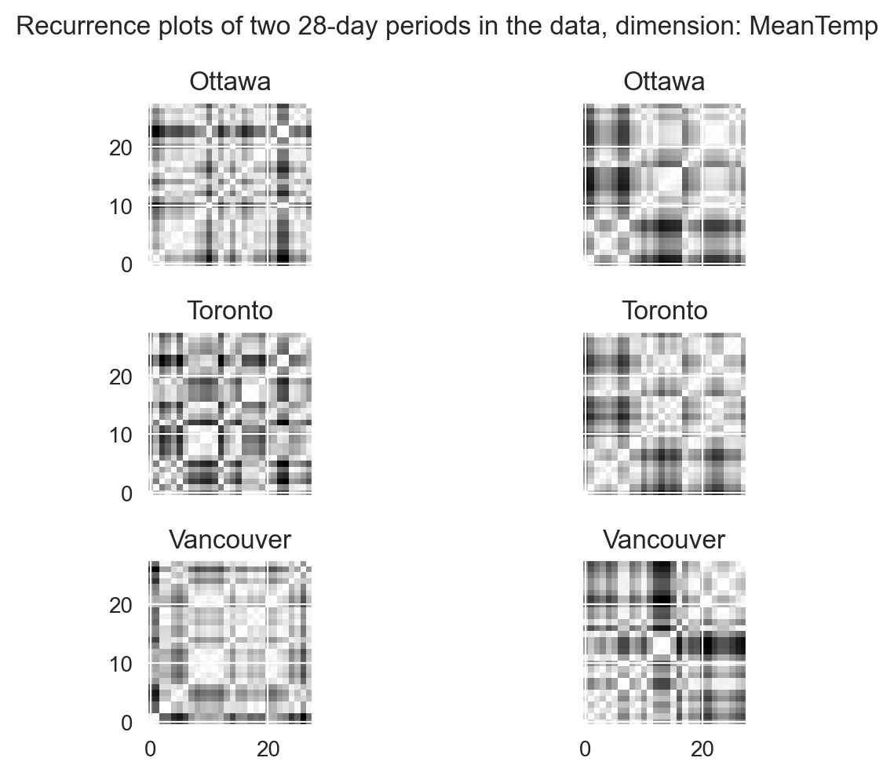
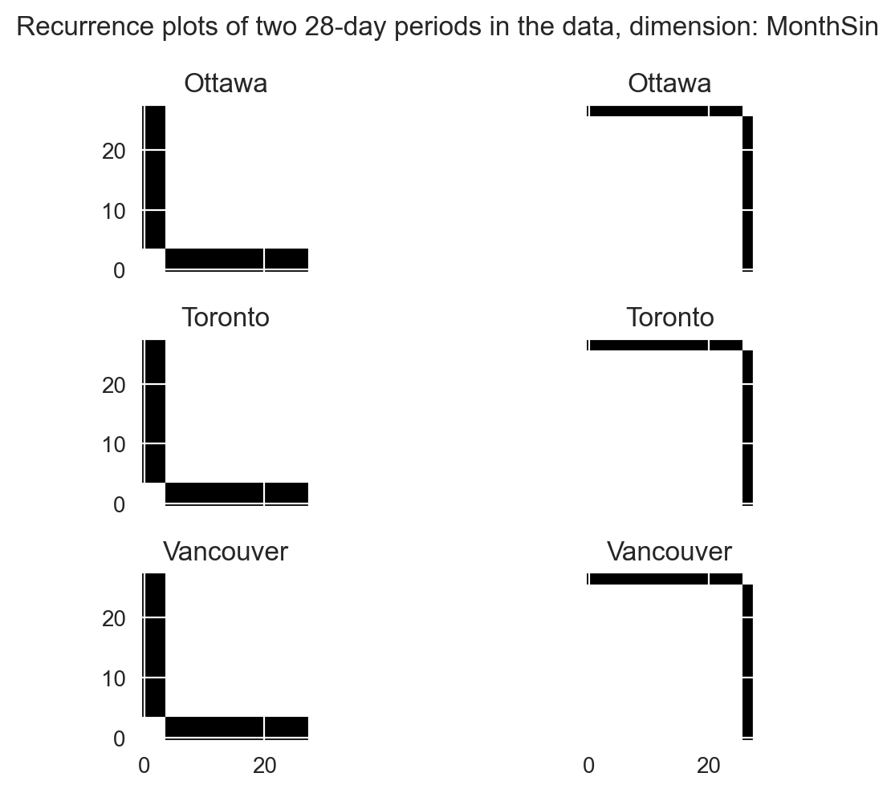
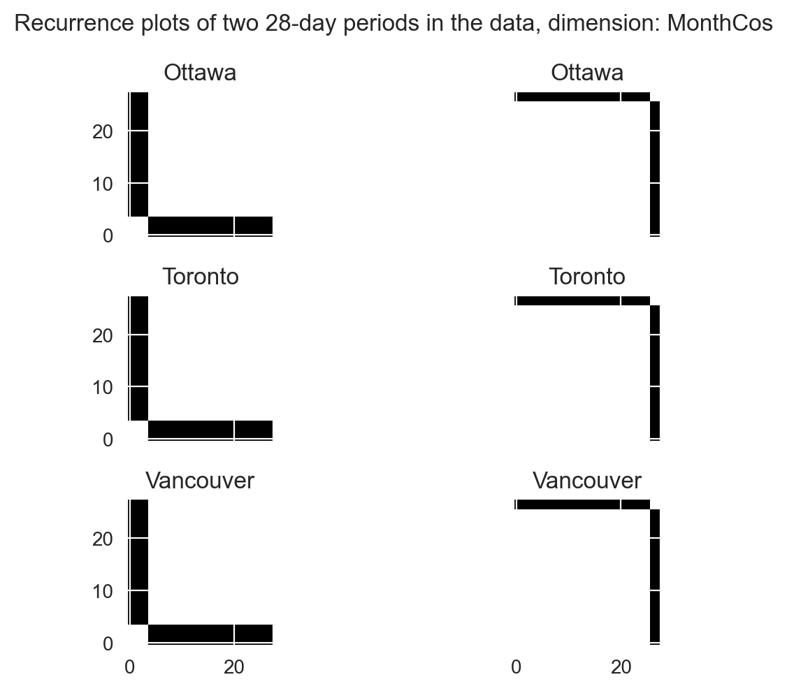

Time series classification - Canadian weather data
================
Ahmet Zamanis

- <a href="#introduction" id="toc-introduction">Introduction</a>
- <a href="#data-preparation" id="toc-data-preparation">Data
  preparation</a>
  - <a href="#recurrence-plot-transformations"
    id="toc-recurrence-plot-transformations">Recurrence plot
    transformations</a>
- <a href="#time-series-classification"
  id="toc-time-series-classification">Time series classification</a>
  - <a href="#k-nearest-neighbors-with-dtw-distance"
    id="toc-k-nearest-neighbors-with-dtw-distance">K-nearest neighbors with
    DTW distance</a>
  - <a href="#rocket-arsenal" id="toc-rocket-arsenal">ROCKET &amp;
    Arsenal</a>
  - <a href="#muse" id="toc-muse">MUSE</a>
  - <a href="#convolutional-neural-network-with-recurrence-plots"
    id="toc-convolutional-neural-network-with-recurrence-plots">Convolutional
    neural network with recurrence plots</a>
- <a href="#performance-comparison"
  id="toc-performance-comparison">Performance comparison</a>
  - <a href="#metrics-table" id="toc-metrics-table">Metrics table</a>
  - <a href="#confusion-matrix-plots"
    id="toc-confusion-matrix-plots">Confusion matrix plots</a>
- <a href="#conclusion" id="toc-conclusion">Conclusion</a>

## Introduction

Refer to data source, code repository

<details>
<summary>Show imports</summary>

``` python
# Data handling
import pandas as pd
import numpy as np
import arff # Installed as liac-arff
import warnings

# Plotting
import matplotlib.pyplot as plt
import seaborn as sns

# PyTorch Lightning & Optuna
import torch
import lightning as L
import optuna

# Time series classifiers
from sktime.classification.distance_based import KNeighborsTimeSeriesClassifier
from sktime.classification.kernel_based import RocketClassifier, Arsenal
from sktime.classification.dictionary_based import MUSE

# Transformations
from pyts.image import RecurrencePlot
from sklearn.preprocessing import OneHotEncoder

# Performance metrics
from sklearn.metrics import accuracy_score, log_loss, confusion_matrix

# Custom Lightning classes
from X_LightningClassesClassif import TrainDataset, TestDataset, CNN, OptunaPruning

# Helper functions
from X_HelperFunctionsClassif import plot_confusion, scale_dims, get_images, plot_images, validate_cnn, test_model
```

</details>
<details>
<summary>Show settings</summary>

``` python
# Set print options
np.set_printoptions(suppress=True, precision=4)
pd.options.display.float_format = '{:.4f}'.format
pd.set_option('display.max_columns', None)

# Set plotting options
plt.rcParams['figure.dpi'] = 300
plt.rcParams['savefig.dpi'] = 300
plt.rcParams["figure.autolayout"] = True
sns.set_style("darkgrid")

# Set Torch settings
torch.set_default_dtype(torch.float32)
torch.set_float32_matmul_precision('high')
L.seed_everything(1923, workers = True)
warnings.filterwarnings("ignore", ".*does not have many workers.*")
```

</details>

## Data preparation

``` python
# Load raw data
raw_data = arff.load(open("./InputData/canadian_climate.arff", "r"))

# Convert to pandas dataframe & view
df = pd.DataFrame(
  raw_data["data"], columns = [x[0] for x in raw_data["attributes"]])
print(df.iloc[:,0:4])
```

                     LOCAL_DATE  MEAN_TEMPERATURE_CALGARY  \
    0      01-Jan-1940 00:00:00                  -11.4000   
    1      02-Jan-1940 00:00:00                  -12.0000   
    2      03-Jan-1940 00:00:00                  -12.0000   
    3      04-Jan-1940 00:00:00                  -11.4000   
    4      05-Jan-1940 00:00:00                  -13.1000   
    ...                     ...                       ...   
    29216  28-Dec-2019 00:00:00                   -7.7000   
    29217  29-Dec-2019 00:00:00                   -3.3000   
    29218  30-Dec-2019 00:00:00                   -1.6000   
    29219  31-Dec-2019 00:00:00                    4.3000   
    29220  01-Jan-2020 00:00:00                   -0.3000   

           TOTAL_PRECIPITATION_CALGARY  MEAN_TEMPERATURE_EDMONTON  
    0                           0.5000                        NaN  
    1                           0.5000                        NaN  
    2                           1.0000                        NaN  
    3                           0.8000                        NaN  
    4                           0.5000                        NaN  
    ...                            ...                        ...  
    29216                       0.0000                   -10.4000  
    29217                       0.0000                    -8.6000  
    29218                       0.0000                   -10.3000  
    29219                       0.0000                    -2.6000  
    29220                       0.0000                    -4.0000  

    [29221 rows x 4 columns]

``` python
# Check missing values: Pre-1960 locations: Calgary, Vancouver, Ottawa, Toronto
pd.isnull(df).sum()
```

    LOCAL_DATE                           0
    MEAN_TEMPERATURE_CALGARY           189
    TOTAL_PRECIPITATION_CALGARY        173
    MEAN_TEMPERATURE_EDMONTON         7657
    TOTAL_PRECIPITATION_EDMONTON      7646
    MEAN_TEMPERATURE_HALIFAX          7164
    TOTAL_PRECIPITATION_HALIFAX       7226
    MEAN_TEMPERATURE_MONCTON          2336
    TOTAL_PRECIPITATION_MONCTON       2767
    MEAN_TEMPERATURE_MONTREAL          755
    TOTAL_PRECIPITATION_MONTREAL       730
    MEAN_TEMPERATURE_OTTAWA             76
    TOTAL_PRECIPITATION_OTTAWA          81
    MEAN_TEMPERATURE_QUEBEC           1214
    TOTAL_PRECIPITATION_QUEBEC        1227
    MEAN_TEMPERATURE_SASKATOON        2473
    TOTAL_PRECIPITATION_SASKATOON     3755
    MEAN_TEMPERATURE_STJOHNS           808
    TOTAL_PRECIPITATION_STJOHNS        822
    MEAN_TEMPERATURE_TORONTO            74
    TOTAL_PRECIPITATION_TORONTO         80
    MEAN_TEMPERATURE_VANCOUVER          53
    TOTAL_PRECIPITATION_VANCOUVER       55
    MEAN_TEMPERATURE_WHITEHORSE       1691
    TOTAL_PRECIPITATION_WHITEHORSE    4095
    MEAN_TEMPERATURE_WINNIPEG          124
    TOTAL_PRECIPITATION_WINNIPEG       247
    dtype: int64

``` python
# Wide to long conversion
df = pd.wide_to_long(
  df, stubnames = ["MEAN_TEMPERATURE", "TOTAL_PRECIPITATION"],
  i = "LOCAL_DATE", j = "LOCATION", sep = "_", suffix = r"\w+")
df = df.reset_index()

# Select observations only for Ottawa, Toronto, Vancouver
df = df[df["LOCATION"].isin(["OTTAWA", "TORONTO", "VANCOUVER"])]

# Convert LOCAL_DATE to datetime, set index for NA interpolation
df["LOCAL_DATE"] = pd.to_datetime(df["LOCAL_DATE"])
df = df.set_index("LOCAL_DATE")

# View long data
print(df)
```

                 LOCATION  MEAN_TEMPERATURE  TOTAL_PRECIPITATION
    LOCAL_DATE                                                  
    1940-01-01     OTTAWA          -17.0000               0.0000
    1940-01-02     OTTAWA          -16.7000               0.5000
    1940-01-03     OTTAWA          -12.3000               0.0000
    1940-01-04     OTTAWA          -16.4000               0.0000
    1940-01-05     OTTAWA          -19.5000               0.0000
    ...               ...               ...                  ...
    2019-12-28  VANCOUVER            5.3000               3.0000
    2019-12-29  VANCOUVER            7.1000               2.4000
    2019-12-30  VANCOUVER            7.5000               5.8000
    2019-12-31  VANCOUVER            8.4000              21.2000
    2020-01-01  VANCOUVER            7.8000               0.8000

    [87663 rows x 3 columns]

``` python
# Interpolate missing values in Ottawa, Toronto, Vancouver
df = df.groupby("LOCATION", group_keys = False).apply(
  lambda g: g.interpolate(method = "time"))
df = df.reset_index()
```

``` python
# Add cyclic terms for month, week of year and day of year
df["month_sin"] = np.sin(2 * np.pi * df["LOCAL_DATE"].dt.month / 12)
df["month_cos"] = np.cos(2 * np.pi * df["LOCAL_DATE"].dt.month / 12)
df["week_sin"] = np.sin(2 * np.pi * df["LOCAL_DATE"].dt.isocalendar().week / 53)
df["week_cos"] = np.cos(2 * np.pi * df["LOCAL_DATE"].dt.isocalendar().week / 53)
df["day_sin"] = np.sin(2 * np.pi * df["LOCAL_DATE"].dt.dayofyear / 366)
df["day_cos"] = np.cos(2 * np.pi * df["LOCAL_DATE"].dt.dayofyear / 366)
```

<details>
<summary>Show code to split data into 28-day sequences</summary>

``` python
# Assign n as one less than the target sequence length
n = 27

# Add counter for days
df["DAYCOUNT"] = df.groupby("LOCATION").LOCATION.cumcount().add(1)

# Add rowgroups: A unique number for each n+1 day sequence
df["ROWGROUP"] = (df["DAYCOUNT"] // (n + 1)).astype(str)
df = df.drop("DAYCOUNT", axis = 1)


# Eliminate rowgroups which are not of length N + 1 per city
n_rowgroups = len(df["ROWGROUP"].unique())
rowgroup_lengths = [
  int(len(df[df["ROWGROUP"] == str(x)]) / 3) for x in range(0, n_rowgroups)]
rowgroups_to_keep = np.where(np.array(rowgroup_lengths) == n + 1)[0].tolist()
rowgroups_to_keep = [str(x) for x in rowgroups_to_keep]
df = df.loc[df["ROWGROUP"].isin(rowgroups_to_keep)]


# Retrieve targets for each sequence
y = df.groupby(["LOCATION", "ROWGROUP"]).head(1)["LOCATION"]
y = y.reset_index().drop("index", axis = 1).values.flatten()

# Get class labels
classes = np.unique(y)


# Retrieve features as 3Darray of shape (n_sequences, n_dimensions, seq_length)

# Get 2D arrays of (n_dimensions, seq_length) for each sequence
x = df.groupby(["LOCATION", "ROWGROUP"], as_index = False).apply(
    lambda g: np.array(
  [g["MEAN_TEMPERATURE"].values,
  g["TOTAL_PRECIPITATION"].values,
  g["month_sin"].values,
  g["month_cos"].values,
  g["week_sin"].values,
  g["week_cos"].values,
  g["day_sin"].values,
  g["day_cos"].values
    ]
  )
)

# Get a single 3Darray
x = np.array([x[i] for i in range(0, len(x))], dtype = np.float64)

# Print data shape
print("Shape of data (n_sequences, n_dimensions, seq_length): " + str(x.shape))
```

</details>

    Shape of data (n_sequences, n_dimensions, seq_length): (3126, 8, 28)

<details>
<summary>Show code to split training & testing data for each
city</summary>

``` python
l = len(y) # Length of entire data, for all 3 cities
len_test = int(l / 3 * 0.2) # Length of test data for one city
len_train = int(l / 3 - len_test) # Length of train data for one city
j = int(l / 3) # Length of entire data for one city

# Get indices for training set, for each city
idx_train = list(range(0, len_train)) + list(range(j, len_train + j)) + list(range(j * 2, len_train + (j * 2))) 

# Get indices for testing set as the difference from the training set 
idx_test = list(range(0, l))
idx_test = list(set(idx_test).difference(idx_train))

# Perform train-test split
y_train, y_test = y[idx_train], y[idx_test]
x_train, x_test = x[idx_train], x[idx_test]

# Print data shapes
print(
  "Shape of training data (n_sequences, n_dimensions, seq_length): " + 
  str(x_train.shape))
print(
  "Shape of testing data (n_sequences, n_dimensions, seq_length): " + 
  str(x_test.shape))
```

</details>

    Shape of training data (n_sequences, n_dimensions, seq_length): (2502, 8, 28)
    Shape of testing data (n_sequences, n_dimensions, seq_length): (624, 8, 28)

### Recurrence plot transformations

Move recurrence plot code comments to text, refer to helper functions
script

``` python
# Create RecurrencePlot transformer
trafo_image = RecurrencePlot()

# Transform the features
x_train_img, x_test_img = get_images(x_train, x_test, trafo_image)

# The output for 1 sequence is of shape (n_dims, seq_length, seq_length). Each
# channel is the values of the recurrence plot for one dimension. We have 8 images
# of 28x28, per 28-day period, per city.
print("Shape of one image-transformed sequence: " + str(x_train_img[0].shape))
```

    Shape of one image-transformed sequence: (8, 28, 28)

``` python
# Plot the recurrence plot for two consecutive sequences per city, for the weather
# dimensions. The plot for each sequence is the pairwise similarity matrix of each 
# trajectory in that sequence. The resulting "images" should identify the city 
# when compared with other "images" for the same city.
plot_images(x_train_img, 0, "MeanTemp", 0, 1, len_train)
plot_images(x_train_img, 1, "TotalPrecip", 0, 1, len_train)
```




``` python
# The plots for the time dimensions in a period are the same for all cities, as
# expected.
plot_images(x_train_img, 2, "MonthSin", 0, 1, len_train)
plot_images(x_train_img, 3, "MonthCos", 0, 1, len_train)
```





## Time series classification

### K-nearest neighbors with DTW distance

``` python
# Create KNN classifier
model_knn = KNeighborsTimeSeriesClassifier(n_neighbors = 3, n_jobs = -1)
```

``` python
# Test KNN classifier
preds_knn, probs_knn, acc_knn, loss_knn = test_model(
  model_knn, x_train, x_test, y_train, y_test, scale = True)
  
# View predicted probabilities for each city
print("KNN classifier predicted probabilities for each city:")
pd.DataFrame(probs_knn, columns = ["Ottawa", "Toronto", "Vancouver"])
```

    KNN classifier predicted probabilities for each city:

<div>
<style scoped>
    .dataframe tbody tr th:only-of-type {
        vertical-align: middle;
    }

    .dataframe tbody tr th {
        vertical-align: top;
    }

    .dataframe thead th {
        text-align: right;
    }
</style>
<table border="1" class="dataframe">
  <thead>
    <tr style="text-align: right;">
      <th></th>
      <th>Ottawa</th>
      <th>Toronto</th>
      <th>Vancouver</th>
    </tr>
  </thead>
  <tbody>
    <tr>
      <th>0</th>
      <td>0.6667</td>
      <td>0.3333</td>
      <td>0.0000</td>
    </tr>
    <tr>
      <th>1</th>
      <td>0.6667</td>
      <td>0.3333</td>
      <td>0.0000</td>
    </tr>
    <tr>
      <th>2</th>
      <td>0.0000</td>
      <td>0.6667</td>
      <td>0.3333</td>
    </tr>
    <tr>
      <th>3</th>
      <td>0.0000</td>
      <td>0.3333</td>
      <td>0.6667</td>
    </tr>
    <tr>
      <th>4</th>
      <td>0.0000</td>
      <td>1.0000</td>
      <td>0.0000</td>
    </tr>
    <tr>
      <th>...</th>
      <td>...</td>
      <td>...</td>
      <td>...</td>
    </tr>
    <tr>
      <th>619</th>
      <td>0.0000</td>
      <td>0.0000</td>
      <td>1.0000</td>
    </tr>
    <tr>
      <th>620</th>
      <td>0.0000</td>
      <td>0.0000</td>
      <td>1.0000</td>
    </tr>
    <tr>
      <th>621</th>
      <td>0.0000</td>
      <td>0.0000</td>
      <td>1.0000</td>
    </tr>
    <tr>
      <th>622</th>
      <td>0.0000</td>
      <td>0.0000</td>
      <td>1.0000</td>
    </tr>
    <tr>
      <th>623</th>
      <td>0.0000</td>
      <td>0.0000</td>
      <td>1.0000</td>
    </tr>
  </tbody>
</table>
<p>624 rows × 3 columns</p>
</div>

### ROCKET & Arsenal

Move code comments to text

``` python
# Create RocketClassifier
model_rocket = RocketClassifier(
  use_multivariate = "yes", n_jobs = -1, random_state = 1923)
  
# Create Arsenal classifier (probabilistic ROCKET ensemble, memory intensive)
model_arsenal = Arsenal(random_state = 1923)
```

``` python
# Test RocketClassifier
preds_rocket, probs_rocket, acc_rocket, loss_rocket = test_model(
  model_rocket, x_train, x_test, y_train, y_test, scale = False)

# View predicted probabilities for each city (ROCKET is non-probabilistic)
print("ROCKET classifier predicted probabilities for each city:")
pd.DataFrame(probs_rocket, columns = ["Ottawa", "Toronto", "Vancouver"])
```

    ROCKET classifier predicted probabilities for each city:

<div>
<style scoped>
    .dataframe tbody tr th:only-of-type {
        vertical-align: middle;
    }

    .dataframe tbody tr th {
        vertical-align: top;
    }

    .dataframe thead th {
        text-align: right;
    }
</style>
<table border="1" class="dataframe">
  <thead>
    <tr style="text-align: right;">
      <th></th>
      <th>Ottawa</th>
      <th>Toronto</th>
      <th>Vancouver</th>
    </tr>
  </thead>
  <tbody>
    <tr>
      <th>0</th>
      <td>1.0000</td>
      <td>0.0000</td>
      <td>0.0000</td>
    </tr>
    <tr>
      <th>1</th>
      <td>0.0000</td>
      <td>1.0000</td>
      <td>0.0000</td>
    </tr>
    <tr>
      <th>2</th>
      <td>0.0000</td>
      <td>0.0000</td>
      <td>1.0000</td>
    </tr>
    <tr>
      <th>3</th>
      <td>1.0000</td>
      <td>0.0000</td>
      <td>0.0000</td>
    </tr>
    <tr>
      <th>4</th>
      <td>1.0000</td>
      <td>0.0000</td>
      <td>0.0000</td>
    </tr>
    <tr>
      <th>...</th>
      <td>...</td>
      <td>...</td>
      <td>...</td>
    </tr>
    <tr>
      <th>619</th>
      <td>1.0000</td>
      <td>0.0000</td>
      <td>0.0000</td>
    </tr>
    <tr>
      <th>620</th>
      <td>0.0000</td>
      <td>0.0000</td>
      <td>1.0000</td>
    </tr>
    <tr>
      <th>621</th>
      <td>0.0000</td>
      <td>1.0000</td>
      <td>0.0000</td>
    </tr>
    <tr>
      <th>622</th>
      <td>0.0000</td>
      <td>0.0000</td>
      <td>1.0000</td>
    </tr>
    <tr>
      <th>623</th>
      <td>0.0000</td>
      <td>0.0000</td>
      <td>1.0000</td>
    </tr>
  </tbody>
</table>
<p>624 rows × 3 columns</p>
</div>

``` python
# Test Arsenal classifier
preds_arsenal, probs_arsenal, acc_arsenal, loss_arsenal = test_model(
  model_arsenal, x_train, x_test, y_train, y_test, scale = False)

# View predicted probabilities for each city
print("Arsenal classifier predicted probabilities for each city:")
pd.DataFrame(probs_arsenal, columns = ["Ottawa", "Toronto", "Vancouver"])
```

    Arsenal classifier predicted probabilities for each city:

<div>
<style scoped>
    .dataframe tbody tr th:only-of-type {
        vertical-align: middle;
    }

    .dataframe tbody tr th {
        vertical-align: top;
    }

    .dataframe thead th {
        text-align: right;
    }
</style>
<table border="1" class="dataframe">
  <thead>
    <tr style="text-align: right;">
      <th></th>
      <th>Ottawa</th>
      <th>Toronto</th>
      <th>Vancouver</th>
    </tr>
  </thead>
  <tbody>
    <tr>
      <th>0</th>
      <td>0.8797</td>
      <td>0.0803</td>
      <td>0.0399</td>
    </tr>
    <tr>
      <th>1</th>
      <td>0.8406</td>
      <td>0.1594</td>
      <td>-0.0000</td>
    </tr>
    <tr>
      <th>2</th>
      <td>0.0809</td>
      <td>-0.0000</td>
      <td>0.9191</td>
    </tr>
    <tr>
      <th>3</th>
      <td>0.8005</td>
      <td>-0.0000</td>
      <td>0.1995</td>
    </tr>
    <tr>
      <th>4</th>
      <td>0.6412</td>
      <td>0.3181</td>
      <td>0.0407</td>
    </tr>
    <tr>
      <th>...</th>
      <td>...</td>
      <td>...</td>
      <td>...</td>
    </tr>
    <tr>
      <th>619</th>
      <td>0.3223</td>
      <td>0.3991</td>
      <td>0.2786</td>
    </tr>
    <tr>
      <th>620</th>
      <td>0.0401</td>
      <td>-0.0000</td>
      <td>0.9599</td>
    </tr>
    <tr>
      <th>621</th>
      <td>0.1202</td>
      <td>0.7997</td>
      <td>0.0801</td>
    </tr>
    <tr>
      <th>622</th>
      <td>-0.0000</td>
      <td>0.0400</td>
      <td>0.9600</td>
    </tr>
    <tr>
      <th>623</th>
      <td>-0.0000</td>
      <td>-0.0000</td>
      <td>1.0000</td>
    </tr>
  </tbody>
</table>
<p>624 rows × 3 columns</p>
</div>

### MUSE

``` python
# Create MUSE classifier
model_muse = MUSE(
  use_first_order_differences = False, # Not meaningful for time features
  support_probabilities = True, # Train LogisticRegression which outputs probs.
  n_jobs = -1, random_state = 1923)
```

``` python
# Test classifier
preds_muse, probs_muse, acc_muse, loss_muse = test_model(
  model_muse, x_train, x_test, y_train, y_test, scale = True)
  
# View predicted probabilities for each city
print("MUSE classifier predicted probabilities for each city:")
pd.DataFrame(probs_muse, columns = ["Ottawa", "Toronto", "Vancouver"])
```

    MUSE classifier predicted probabilities for each city:

<div>
<style scoped>
    .dataframe tbody tr th:only-of-type {
        vertical-align: middle;
    }

    .dataframe tbody tr th {
        vertical-align: top;
    }

    .dataframe thead th {
        text-align: right;
    }
</style>
<table border="1" class="dataframe">
  <thead>
    <tr style="text-align: right;">
      <th></th>
      <th>Ottawa</th>
      <th>Toronto</th>
      <th>Vancouver</th>
    </tr>
  </thead>
  <tbody>
    <tr>
      <th>0</th>
      <td>0.9806</td>
      <td>0.0193</td>
      <td>0.0001</td>
    </tr>
    <tr>
      <th>1</th>
      <td>0.9182</td>
      <td>0.0815</td>
      <td>0.0004</td>
    </tr>
    <tr>
      <th>2</th>
      <td>0.1718</td>
      <td>0.8188</td>
      <td>0.0094</td>
    </tr>
    <tr>
      <th>3</th>
      <td>0.8385</td>
      <td>0.1569</td>
      <td>0.0046</td>
    </tr>
    <tr>
      <th>4</th>
      <td>0.3225</td>
      <td>0.5561</td>
      <td>0.1215</td>
    </tr>
    <tr>
      <th>...</th>
      <td>...</td>
      <td>...</td>
      <td>...</td>
    </tr>
    <tr>
      <th>619</th>
      <td>0.1121</td>
      <td>0.0023</td>
      <td>0.8856</td>
    </tr>
    <tr>
      <th>620</th>
      <td>0.0054</td>
      <td>0.0128</td>
      <td>0.9818</td>
    </tr>
    <tr>
      <th>621</th>
      <td>0.0651</td>
      <td>0.0010</td>
      <td>0.9339</td>
    </tr>
    <tr>
      <th>622</th>
      <td>0.0006</td>
      <td>0.0230</td>
      <td>0.9764</td>
    </tr>
    <tr>
      <th>623</th>
      <td>0.0001</td>
      <td>0.0289</td>
      <td>0.9710</td>
    </tr>
  </tbody>
</table>
<p>624 rows × 3 columns</p>
</div>

### Convolutional neural network with recurrence plots

Refer to classes script for Ligtning code, CNN script for Optuna tuning
code

#### Data prep

<details>
<summary>Show code to prepare data for CNN training</summary>

``` python
# Convert multiclass targets into binary matrices of shape (n_seq, n_classes)
encoder_onehot = OneHotEncoder(sparse_output = False)
y_train_img = encoder_onehot.fit_transform(y_train.reshape(-1, 1))
y_test_img = encoder_onehot.fit_transform(y_test.reshape(-1, 1))


# Load data into TrainDataset
train_data = TrainDataset(x_train_img, y_train_img)
test_data = TestDataset(x_test_img)

# Create dataloaders
train_loader = torch.utils.data.DataLoader(
  train_data, batch_size = 128, num_workers = 0, shuffle = True)
test_loader = torch.utils.data.DataLoader(
  test_data, batch_size = len(test_data), num_workers = 0, shuffle = False)


# Import best trial
best_trial_cnn = pd.read_csv("./OutputData/trials_cnn1.csv").iloc[0,]

# Retrieve best hyperparameters
hyperparams_dict = {
    "input_channels": x_train.shape[1],
    "learning_rate": best_trial_cnn["params_learning_rate"],
    "lr_decay": best_trial_cnn["params_lr_decay"]
  }
```

</details>

#### Model testing

``` python
# Create trainer
trainer = L.Trainer(
  max_epochs = int(best_trial_cnn["user_attrs_n_epochs"]),
  accelerator = "gpu", devices = "auto", precision = "16-mixed",
  enable_model_summary = True,
  logger = True,
  log_every_n_steps = 20,
  enable_progress_bar = True,
  enable_checkpointing = True
)

# Create & train model
model = CNN(hyperparams_dict)
trainer.fit(model, train_loader)
```

    Training: 0it [00:00, ?it/s]

``` python
# Predict testing data
probs_cnn = trainer.predict(model, test_loader)
probs_cnn = probs_cnn[0].cpu().numpy().astype(np.float32)

# Convert to class predictions
preds_cnn = classes[np.argmax(probs_cnn, axis = 1)]

# Calculate performance metrics
acc_cnn = accuracy_score(classes[np.argmax(y_test_img, axis = 1)], preds_cnn) 
loss_cnn = log_loss(y_test_img, probs_cnn) 

# View predicted probabilities for each city
print("CNN classifier predicted probabilities for each city:")
pd.DataFrame(probs_cnn, columns = ["Ottawa", "Toronto", "Vancouver"])
```

    Predicting: 0it [00:00, ?it/s]

    CNN classifier predicted probabilities for each city:

<div>
<style scoped>
    .dataframe tbody tr th:only-of-type {
        vertical-align: middle;
    }

    .dataframe tbody tr th {
        vertical-align: top;
    }

    .dataframe thead th {
        text-align: right;
    }
</style>
<table border="1" class="dataframe">
  <thead>
    <tr style="text-align: right;">
      <th></th>
      <th>Ottawa</th>
      <th>Toronto</th>
      <th>Vancouver</th>
    </tr>
  </thead>
  <tbody>
    <tr>
      <th>0</th>
      <td>0.4494</td>
      <td>0.5506</td>
      <td>0.0001</td>
    </tr>
    <tr>
      <th>1</th>
      <td>0.5916</td>
      <td>0.4082</td>
      <td>0.0002</td>
    </tr>
    <tr>
      <th>2</th>
      <td>0.5497</td>
      <td>0.4487</td>
      <td>0.0016</td>
    </tr>
    <tr>
      <th>3</th>
      <td>0.6482</td>
      <td>0.3122</td>
      <td>0.0396</td>
    </tr>
    <tr>
      <th>4</th>
      <td>0.3470</td>
      <td>0.5338</td>
      <td>0.1192</td>
    </tr>
    <tr>
      <th>...</th>
      <td>...</td>
      <td>...</td>
      <td>...</td>
    </tr>
    <tr>
      <th>619</th>
      <td>0.0125</td>
      <td>0.0239</td>
      <td>0.9636</td>
    </tr>
    <tr>
      <th>620</th>
      <td>0.0007</td>
      <td>0.0005</td>
      <td>0.9989</td>
    </tr>
    <tr>
      <th>621</th>
      <td>0.0129</td>
      <td>0.0085</td>
      <td>0.9786</td>
    </tr>
    <tr>
      <th>622</th>
      <td>0.0013</td>
      <td>0.0007</td>
      <td>0.9980</td>
    </tr>
    <tr>
      <th>623</th>
      <td>0.0002</td>
      <td>0.0002</td>
      <td>0.9997</td>
    </tr>
  </tbody>
</table>
<p>624 rows × 3 columns</p>
</div>

## Performance comparison

### Metrics table

<details>
<summary>Show code to create performance metrics table</summary>

``` python
# Generate random chance performance metrics
p = 0.33
probs_random = np.repeat(np.repeat(p, 3), len(y_test))
probs_random = np.reshape(probs_random, (len(y_test), 3))
loss_random = log_loss(y_test, probs_random) 

# Gather performance metrics as dictionary
dict_metrics = {
  "Accuracy": [
    round(x, 4) for x in [
      p, acc_knn, acc_rocket, acc_arsenal, acc_muse, acc_cnn]],
  "Log loss": [
    round(x, 4) for x in [
      loss_random, loss_knn, loss_rocket, loss_arsenal, loss_muse, loss_cnn]]   
}

# Print as table
pd.DataFrame(dict_metrics, index = [
  "Random choice", "kNN with DTW", "ROCKET", "Arsenal", "MUSE", "CNN"])
```

</details>
<div>
<style scoped>
    .dataframe tbody tr th:only-of-type {
        vertical-align: middle;
    }

    .dataframe tbody tr th {
        vertical-align: top;
    }

    .dataframe thead th {
        text-align: right;
    }
</style>
<table border="1" class="dataframe">
  <thead>
    <tr style="text-align: right;">
      <th></th>
      <th>Accuracy</th>
      <th>Log loss</th>
    </tr>
  </thead>
  <tbody>
    <tr>
      <th>Random choice</th>
      <td>0.3300</td>
      <td>1.0986</td>
    </tr>
    <tr>
      <th>kNN with DTW</th>
      <td>0.6603</td>
      <td>5.5750</td>
    </tr>
    <tr>
      <th>ROCKET</th>
      <td>0.5401</td>
      <td>16.5778</td>
    </tr>
    <tr>
      <th>Arsenal</th>
      <td>0.5577</td>
      <td>2.3086</td>
    </tr>
    <tr>
      <th>MUSE</th>
      <td>0.6074</td>
      <td>1.1958</td>
    </tr>
    <tr>
      <th>CNN</th>
      <td>0.6522</td>
      <td>0.6695</td>
    </tr>
  </tbody>
</table>
</div>

### Confusion matrix plots

<details>
<summary>Show code to create confusion matrix plots</summary>

``` python
# Gather class predictions as dictionary
dict_preds = {
  "kNN with DTW": preds_knn,
  # "ROCKET + ridge": preds_rocket,
  "Arsenal + ridge": preds_arsenal,
  "MUSE + logistic": preds_muse,
  "CNN with recurrence plots": preds_cnn
}

# Gather axes as dictionary
dict_axes = {
  "kNN with DTW": (0, 0),
  "Arsenal + ridge": (0, 1),
  "MUSE + logistic": (1, 0),
  "CNN with recurrence plots": (1, 1)
}

# Create figure
fig, ax = plt.subplots(2,2, sharey = True, sharex = True)
_ = fig.suptitle("Confusion matrices of time series classifiers")

# Generate plots
for key in dict_preds.keys():
  
  # Get confusion matrix
  matrix = confusion_matrix(y_test, dict_preds[key], labels = classes)
  
  # Create plot
  idx = dict_axes[key]
  _ = sns.heatmap(
      matrix, xticklabels = classes, yticklabels = classes, cmap = "Reds", 
      annot = True, fmt = "g", square = True, cbar = False, linecolor = "black", 
      linewidths = 0.5, ax = ax[idx])
  _ = ax[idx].set_xlabel("Predicted classes")
  _ = ax[idx].set_ylabel("True classes")
  _ = ax[idx].set_title(key)

plt.show()
plt.close("all")
```

</details>


## Conclusion
